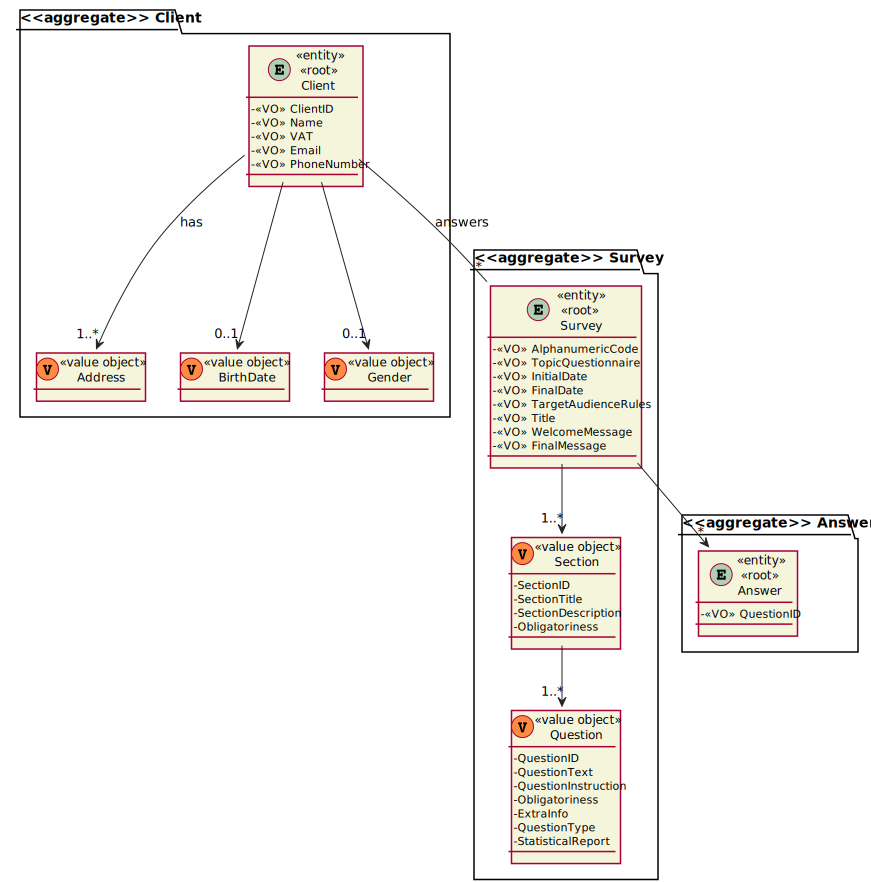

# 3002 - "As Sales Manager, I want to get a statistical report regarding a previously set up questionnaire."

# 1. Requisitos

**UC3002:** Como Sales Manager, pretendo gerar um relatório estatístico relativo a um questionário previamente configurado.

A interpretação feita deste requisito foi no sentido de permitir ao sales manager visualizar relatórios estatísticos dos questionários que existem no sistema.

# 2. Análise

## 2.1. Respostas do Cliente

> Q1: For this US, what are the types of statistical report that Sales Clerk want to see?
>
> A1: Any report must have the basic:
> 
> - Universe Size (implies knowing the amount of users the survey was distributed to);
> - Number of Responses Obtained
> - % of responses obtained;
>
>Further, something depending on the question type:
> 
> For “Single-Choice” questions:
> - Distribution (in %) of responses for each alternative (e.g.: A = 30%, B = 27%, C = 40%, Others = 3%)
>
> For “Multiple-Choice” questions:
> - Distribution (in %) of responses for each alternative (e.g.: A = 30%, B = 27%, C = 40%, Others = 3%)
> - Distribution (in %) of combined responses (e.g.: A+B = 15%, A+C = 100%, B+C=100%, A+B+C=10%)
>
> For “Sorting-Options” questions:
> - Distribution of the various hypotheses for each position (e.g.: 1st Place = A(40%) B (60%) C(0%); 2nd Place = A(50%) B(40%) C(10%); 3rd Place =A(10%) C(90%))
>
> For “Scaling-Options” questions:
> - Distribution of each option by scale levels.

> Q2: For this US, does the statistical report need to be shown to the SalesClerk or needs to be saved in some file too (p.e. text file)?
> 
> A2: The important is to show the statistical report.
> 
> Saving the report is not seen as relevant since, at any time, the user might request to see the report again.
>
> Notice that the information on which the report is computed is already persisted on the system.

## 2.2. Regras de Negócio

* "The report should be generated considering the given questionnaire and the set of answers obtained until the current moment."

# 3. Design

## 3.1. Realização da Funcionalidade

### 3.1.1. Modelo de Domínio:

### 3.1.2. Classes de Domínio:

* Questionnaire
* Answer
* Controlador:
  * GenerateReportController
* Repository:
  * AnswerQuestionnaireRepository
  * SurveyQuestionnaireRepository

### 3.1.3. Diagrama de Sequência do Sistema:

### 3.1.4. Diagrama de Sequência:

## 3.2. Diagrama de Classes

# 4. Implementação

## 4.1. Classe SurveyQuestionsVisitor

    [...]
      @Override
      public Boolean visitFree_text(questionnaireParser.Free_textContext ctx) {
          String questionID = ctx.numeric_id().getText();
          System.out.println("Question " + questionID + " is a free text question. Therefore, there are no statistical analysis available.\n");
          return true;
      }
    [...]
      @Override
      public Boolean visitSingle_choice(questionnaireParser.Single_choiceContext ctx) {
          String questionID = ctx.numeric_id().getText();
          System.out.println("Question " + questionID + " is a single choice question.");
          List<List<String>> answers = questionsAnswers.get(ctx.numeric_id().getText());
          Map<Integer, Integer> responses = new HashMap<>();
          int optionsNumber = ctx.option().size();
          for (int i = 0; i < optionsNumber; i++) {
              responses.put(optionsNumber,0);
          }
          Integer response;
          for (List<String> answer:
               answers) {
              response = Integer.valueOf(answer.get(0));
              if (!responses.containsKey(response)){
                  responses.put(response,1);
              } else {
                  responses.replace(response,responses.get(response)+1);
              }
          }
          int totalAnswers = answers.size();
          for (Map.Entry<Integer, Integer> entry :
                  responses.entrySet()) {
              System.out.print("Option " + entry.getKey() + " = " + (double)((entry.getValue()*100/totalAnswers)* 10d)/10d + "%, ");
          }
          System.out.println("\n");
          return true;
      }
    [...]

Methods visitNumeric(ctx), +visitSingle_choice_with_input(ctx) and visitMultiple_choice_with_input(ctx) have similar implementations to the one of visitFree_text(ctx).

Methods visitMultiple_choice(ctx), visitSorting_option(ctx) and visitScaling_option(ctx) have similar implementations to the one of visitSingle_choice(ctx).

# 3. Integração/Demonstração

Esta User Story depende da User Story 3001 e 3501, uma vez que é necessária a existência de questionários, que podem ser respondidos por clientes, para que possam ser gerados relatórios com os resultados obtidos.

# 4. Observações

A User Story foi implementada na totalidade, com sucesso.