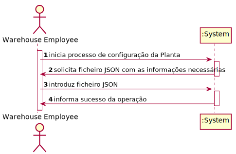
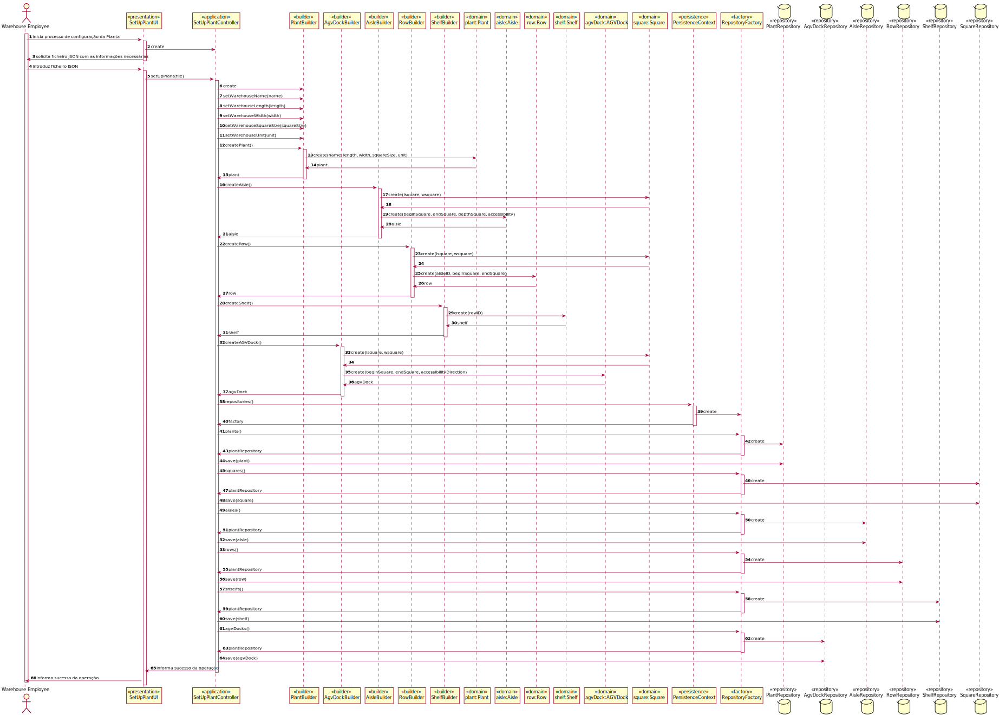

# 2001 - "As Warehouse Employee, I want to set up the warehouse plant by uploading a JSON file."

# 1. Requisitos

**UC2001:** Como Warehouse Employee desejo construir a planta do warehouse através de um ficheiro JSON.

A interpretação feita deste requisito foi a de definir uma planta de um warehouse com as informações disponiveis num ficheiro JSON.

# 2. Análise

## 2.1. Respostas do Cliente

>Q1: "Does a warehouse always have the same plant or can it have different plants in the future?"
>
>A1: "Each warehouse has its own plant and, therefore, plants might vary from one warehouse to another. However, any warehouse plant is described by a JSON file according to the data structure described in section 5.2 of the specifications' document. On US2001, any JSON file meeting such data structure must be supported."

>Q2: "Regarding the shelves in each row that are part of an aisle, is there a need to differentiate them? If not, how will the AGV know on which shelf to look for a product? Because, as we understood, different products can be placed on a different shelf of the same row, and according to the JSON file provided, each row only states how many shelves it has."
>
>A2: "Yes! You need to differentiate the shelves in each row of an aisle."

>Q3: "Regarding the upload of a JSON file, is that file supposed to be stored with the rest of the application and be uploaded every time the application runs or should the upload be done only once where the information would all be uploaded to the application database and the JSON file discarded/not stored?"
>
>A3: "The purpose of uploading a JSON file (US2001) is to set up the warehouse plant information required to the system work properly. Once that information is set up, there is no need to repeat the set up process."

 
## 2.2. Regras de Negócio

* As ids de Aisles, Rows e AVGDocks têm que ser únicas no sistema;
* A length do Warehouse é sempre superior ou igual a zero;
* A Width do Warehouse é sempre superior ou igual a zero;
* O Square do Warehouse é sempre superior ou igual a zero;
* A Unit do Warehouse é sempre superior ou igual a zero;
* Aisle accessibility tem de ter 2 chars;

# 3. Design

*Nesta secção a equipa deve descrever o design adotado para satisfazer a funcionalidade. Entre outros, a equipa deve apresentar diagrama(s) de realização da funcionalidade, diagrama(s) de classes, identificação de padrões aplicados e quais foram os principais testes especificados para validar a funcionalidade.*

*Para além das secções sugeridas, podem ser incluídas outras.*

## 3.1. Realização da Funcionalidade

### 3.1.1. Classes de Domínio:

* WarehousePlant, Aisle, Row, Shelf, AVGDock
* Controlador:
  * SetWarehousePlantController
* Repository:
  * WarehouseRepository

### 3.1.2. Diagrama de Sequência do Sistema:

### 3.1.3. Diagrama de Sequência:

## 3.2. Diagrama de Classes

## 3.3. Padrões Aplicados

*Nesta secção deve apresentar e explicar quais e como foram os padrões de design aplicados e as melhores práticas.*

## 3.4. Testes
*Nesta secção deve sistematizar como os testes foram concebidos para permitir uma correta aferição da satisfação dos requisitos.*

**Teste 1:** Verificar que não é possível configurar a planta com um ficheiro incorreto.

	@Test(expected = IllegalArgumentException.class)
        //to develop
    }

**Teste 2:** Verificar que não é possível configurar a planta com uma Length nula.

	@Test(expected = IllegalArgumentException.class)
        //to develop
    }

**Teste 3:** Verificar que não é possível configurar a planta com uma Width nula.

	@Test(expected = IllegalArgumentException.class)
        //to develop
    }

**Teste 4:** Verificar que não é possível configurar a planta com o Square nulo.

	@Test(expected = IllegalArgumentException.class)
        //to develop
    }

**Teste 5:** Verificar que não é possível configurar a planta com a Unit nula.

	@Test(expected = IllegalArgumentException.class)
        //to develop
    }

**Teste 6:** Verificar que não é possível configurar a planta com a Aisle Accessibility nula.

	@Test(expected = IllegalArgumentException.class)
        //to develop
    }

**Teste 7:** Verificar que não é possível configurar a planta com uma Length menor que zero.

	@Test(expected = IllegalArgumentException.class)
        //to develop
    }

**Teste 8:** Verificar que não é possível configurar a planta com uma Width menor que zero.

	@Test(expected = IllegalArgumentException.class)
        //to develop
    }

**Teste 9:** Verificar que não é possível configurar a planta com o Square menor que zero.

	@Test(expected = IllegalArgumentException.class)
        //to develop
    }

**Teste 10:** Verificar que não é possível configurar a planta com a Unit menor que zero.

	@Test(expected = IllegalArgumentException.class)
        //to develop
    }

**Teste 11:** Verificar que não é possível configurar a planta com a Aisle Accessibility com mais de 2 chars.

	@Test(expected = IllegalArgumentException.class)
        //to develop
    }

# 4. Implementação

*Nesta secção a equipa deve providenciar, se necessário, algumas evidências de que a implementação está em conformidade com o design efetuado. Para além disso, deve mencionar/descrever a existência de outros ficheiros (e.g. de configuração) relevantes e destacar commits relevantes;*

*Recomenda-se que organize este conteúdo por subsecções.*

# 5. Integração/Demonstração

*Nesta secção a equipa deve descrever os esforços realizados no sentido de integrar a funcionalidade desenvolvida com as restantes funcionalidades do sistema.*

# 6. Observações

*Nesta secção sugere-se que a equipa apresente uma perspetiva critica sobre o trabalho desenvolvido apontando, por exemplo, outras alternativas e ou trabalhos futuros relacionados.*

