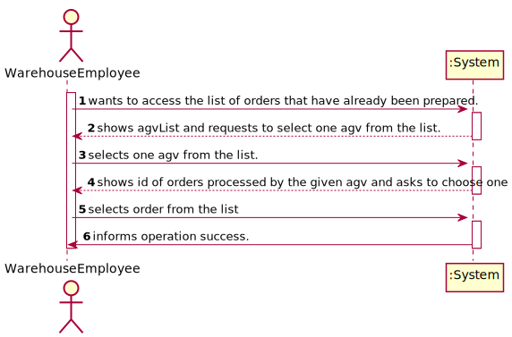
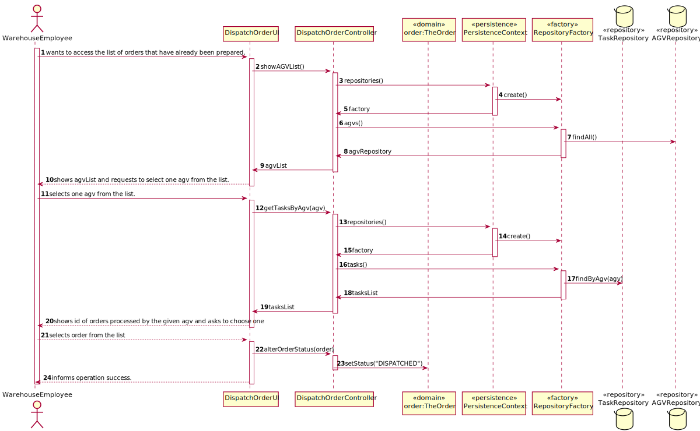
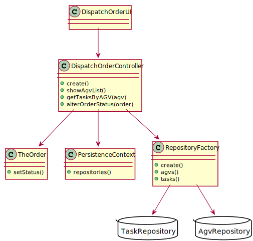
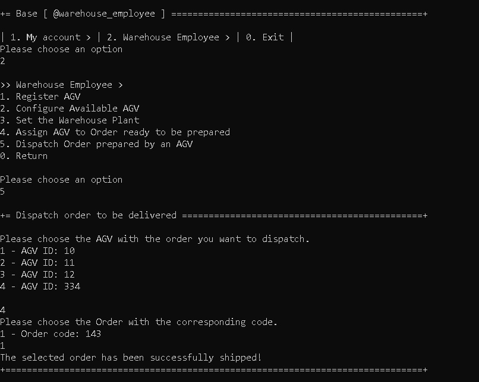

# 2004 - "As Warehouse Employee, I want to access the list of orders that have already been prepared by the AGVs and be able to update any of those orders as having been dispatched for customer delivery. "

# 1. Requisitos

**UC2004:** Como Warehouse Employee desejo alterar o status de uma Order para "Dispatched".

A interpretação feita deste requisito foi a de alterar o status de uma Order escolhida pelo Warehouse Employee para "Dispatched".

# 2. Análise

## 2.1. Respostas do Cliente

>Q1: "What do you mean by filtering the list by AGV? Do you mean the list of Product Orders ordinated by AGV name?"
>
>A1: "What is being requested is the ability to filter the presented orders by the AGV that has performed the respective task, i.e. to show the list of orders that have been prepared by a given AGVs."

>Q2: "Regarding this feature, what would you consider to be its complete state, that is, what would be the criterion to define whether or not this feature was functional?"
>
>A2: "it seems the criteria you are looking for is somehow obvious: the status of the selected order(s) changed from "already been prepared by the AGV" to "dispatched for customer delivery"."

 
## 2.2. Regras de Negócio

* É primeiro escolhido o AGV que está encarregue da Order que se quer despachar, só depois é que se escolhe a Order.

# 3. Design

## 3.1. Realização da Funcionalidade

### 3.1.1. Classes de Domínio:

* TheOrder
* Controlador:
  * DispatchOrderController
* Repository:
  * AGVRepository
  * TaskRepository

### 3.1.2. Diagrama de Sequência do Sistema:

### 3.1.3. Diagrama de Sequência:

## 3.2. Diagrama de Classes

## 3.3. Padrões Aplicados

*Nesta secção deve apresentar e explicar quais e como foram os padrões de design aplicados e as melhores práticas.*

## 3.4. Testes
*Nesta secção deve sistematizar como os testes foram concebidos para permitir uma correta aferição da satisfação dos requisitos.*

**Teste 1:** Verificar que Task é criada.

	@Test
    public void ensureTaskIsCreated(){
        //test
    }

**Teste 2:** Verificar que Task não pode ser criada com AGV null.

	@Test(expected = IllegalArgumentException.class)
    public void ensureTaskAGVNotNull(){
        //test
    }

**Teste 3:** Verificar que Task não pode ser criada com Order null.

    @Test(expected = IllegalArgumentException.class)
    public void ensureTaskOrderNotNull(){
        //test
    }

# 4. Implementação

*Nesta secção a equipa deve providenciar, se necessário, algumas evidências de que a implementação está em conformidade com o design efetuado. Para além disso, deve mencionar/descrever a existência de outros ficheiros (e.g. de configuração) relevantes e destacar commits relevantes;*

*Recomenda-se que organize este conteúdo por subsecções.*

    public Map<Integer, AGV> showAGVList(){
        authz.ensureAuthenticatedUserHasAnyOf(BaseRoles.POWER_USER, BaseRoles.WAREHOUSE_EMPLOYEE);

        Iterable<AGV> agvs = agvRepository.findAll();
        Map<Integer, AGV> result = new HashMap<>();
        int i=1;

        for(AGV agv: agvs) {
            result.put(i, agv);
            i++;
        }

        return result;
    }

    public Map<Integer, TheOrder> findByAGV(AGV agv){
        authz.ensureAuthenticatedUserHasAnyOf(BaseRoles.POWER_USER, BaseRoles.WAREHOUSE_EMPLOYEE);

        Iterable<TheTask> tasks= taskRepository.findByAgv(agv);
        Map<Integer, TheOrder> result = new HashMap<>();
        int i=1;

        for(TheTask task: tasks){
            result.put(i, task.order());
            i++;
        }

        return result;
    }

    public void alterOrderStatus(TheOrder order){
        authz.ensureAuthenticatedUserHasAnyOf(BaseRoles.POWER_USER, BaseRoles.WAREHOUSE_EMPLOYEE);

        order.setStatus(OrderStatus.valueOf(OrderStatus.Status.DISPATCHED));

       orderRepository.save(order);
    }

# 5. Integração/Demonstração

*Nesta secção a equipa deve descrever os esforços realizados no sentido de integrar a funcionalidade desenvolvida com as restantes funcionalidades do sistema.*

# 6. Observações

*Nesta secção sugere-se que a equipa apresente uma perspetiva critica sobre o trabalho desenvolvido apontando, por exemplo, outras alternativas e ou trabalhos futuros relacionados.*

