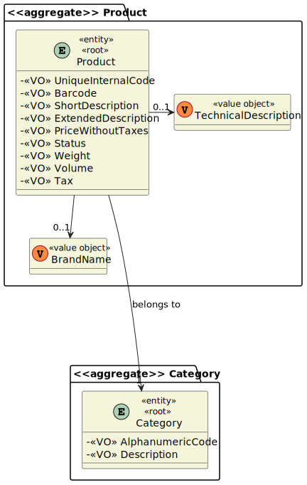

# 1002 - "As Sales Clerk, I want to view/search the products catalog."

# 1. Requisitos

**UC1002:** Como Sales Clerk, eu quero visualizar o catálogo de produtos.

A interpretação feita deste requisito foi a de mostrar as informações básicas de um ou mais produtos que estejam registados no sistema, ou seja, que estejam no catálogo, tendo em conta que poderá, ou não, haver filtros para efetuar essa pesquisa.

# 2. Análise

## 2.1. Respostas do Cliente

> Q1: "In the us1002 we have 3 filters (category, brand and description) to search for products, but can the Sales Clerk only use a filter by search or can use the three?"
> 
> A1:
> "Follow common sense...
> 
> Put yourself on the Sales Clerk shoes.
> 
> What would you as a Sales Clerk expect from the system?
> 
> Probably, you would figure out that sometimes you need to filter using just one attribute and on another case you need to apply/combine filtering criteria of two or more attributes."

> Q2: "Should the sales clerk select/specify the catalog presentation order before he/she can see the catalog? Or the catalog is presented in a default order, and then if the sales clerk wants, he/she can change it? The same doubt came on the filtering.
> 
> Talking about data presentation orders, which ones should exist?"
> 
> A2: "
>1. Data to be used to filter the products catalog content should be asked ahead.
>
>2. Regarding presentation order, the necessary data can be asked either: ahead and after presenting them."

> Q3: "Regarding the product search, is there a field you want to use to filter the data and any desired data presentation order? And do you want to see all the fields or just a simplified summary?"
> 
> A3: "Commonly fields used to filter products are:
> 
> - Category
> - Description (any of the available descriptions)
> - Brand
>
>User should select/specify a data presentation order. This applies to any similar US. 
> 
> At least the product' code, short description, brand, category and unit price should be presented. 
> 
> More details can be presented for a given/selected product at user request."

## 2.2. Regras de Negócio

* Deveram ser disponibilizados ao utilizador 3 filtros diferentes (Brand, Description e Category) e este deve poder selecionar se quer usar, ou não, filtros e, se sim, quais quer utilizar na sua pesquisa.

# 3. Design

*Nesta secção a equipa deve descrever o design adotado para satisfazer a funcionalidade. Entre outros, a equipa deve apresentar diagrama(s) de realização da funcionalidade, diagrama(s) de classes, identificação de padrões aplicados e quais foram os principais testes especificados para validar a funcionalidade.*

*Para além das secções sugeridas, podem ser incluídas outras.*

## 3.1. Realização da Funcionalidade

### 3.1.1. Classes de Domínio:

* Product, ProductCategory 
* Controlador:
    * ViewProductCatalogController
* Repository:
    * ProductRepository
    * ProductCategoryRepository

### 3.1.2. Diagrama de Sequência do Sistema:

### 3.1.3. Diagrama de Sequência:

## 3.2. Diagrama de Classes

## 3.3. Padrões Aplicados

*Nesta secção deve apresentar e explicar quais e como foram os padrões de design aplicados e as melhores práticas.*

## 3.4. Testes
*Nesta secção deve sistematizar como os testes foram concebidos para permitir uma correta aferição da satisfação dos requisitos.*

# 4. Implementação

*Nesta secção a equipa deve providenciar, se necessário, algumas evidências de que a implementação está em conformidade com o design efetuado. Para além disso, deve mencionar/descrever a existência de outros ficheiros (e.g. de configuração) relevantes e destacar commits relevantes;*

    public class ViewProductCatalogController {
      private final AuthorizationService authz = AuthzRegistry.authorizationService();
  
      private final ProductRepository productRepository = PersistenceContext.repositories().products();
  
      private final ProductCategoryRepository productCategoryRepository = PersistenceContext.repositories().productCategories();
  
      public List<String> showProductCatalogFilteredByAll(){
          Iterable<String> filteredByBrand = new ArrayList<>();
          Iterable<String> filteredByDescription = new ArrayList<>();
          Iterable<String> filteredByCategory = new ArrayList<>();
          List<String> catalog = new LinkedList<>();
  
          filteredByBrand = showProductCatalogFilteredByBrand();
  
          for(String brand : filteredByBrand){
              catalog.add(brand);
          }
  
          filteredByDescription = showProductCatalogFilteredByDescription();
  
          for(String description : filteredByDescription){
              catalog.add(description);
          }
  
          filteredByCategory = showProductCatalogFilteredByCategory();
  
          for(String category : filteredByCategory){
              catalog.add(category);
          }
  
          return catalog;
      }
  
      public List<String> showProductCatalogFilteredByBrand(){
          Iterable<BrandName> filteredByBrand = new ArrayList<>();
          List<String> catalogByBrand = new LinkedList<>();
          Iterable<Product> productFilteredByBrand = new ArrayList<>();
  
          filteredByBrand = productRepository.findAllBrandName();
  
          for(BrandName brand : filteredByBrand){
              catalogByBrand.add(String.format("Products with the brand - '%s': \n", brand.brandName()));
  
              productFilteredByBrand = productRepository.findByBrandName(brand);
  
              for(Product product : productFilteredByBrand){
                  catalogByBrand.add(String.format("> %s", product.toString()));
              }
          }
  
          return catalogByBrand;
      }
  
      public List<String> showProductCatalogFilteredByDescription(){
          Iterable<ExtendedDescription> filteredByDescription = new ArrayList<>();
          List<String> catalogByDescription = new LinkedList<>();
          Iterable<Product> productFilteredByDescription = new ArrayList<>();
  
          filteredByDescription = productRepository.findAllDescription();
  
          for(ExtendedDescription description : filteredByDescription){
              catalogByDescription.add(String.format("Products with the description - '%s': \n", description.extendedDescription()));
  
              productFilteredByDescription = productRepository.findByExtendedDescription(description);
  
              for(Product product : productFilteredByDescription){
                  catalogByDescription.add(String.format("> %s", product.toString()));
              }
          }
  
          return catalogByDescription;
      }
  
      public List<String> showProductCatalogFilteredByCategory(){
          Iterable<ProductCategory> filteredByCategory = new ArrayList<>();
          List<String> catalogByCategory = new LinkedList<>();
          Iterable<Product> productFilteredByCategory = new ArrayList<>();
  
          filteredByCategory = productCategoryRepository.findAllCategory();
  
          for(ProductCategory category : filteredByCategory){
              catalogByCategory.add(String.format("Products with '%s': \n", category.getDescription()));
  
              productFilteredByCategory = productRepository.findByCategory(category);
  
              for(Product product : productFilteredByCategory){
                  catalogByCategory.add(String.format("> %s", product.toString()));
              }
          }
  
          return catalogByCategory;
      }
  
      public List<String> showProductCatalog(){
          List<String> catalog = new LinkedList<>();
  
          for(Product product : productRepository.findAll()){
              catalog.add(product.toString());
          }
  
          return catalog;
      }
    }

# 5. Integração/Demonstração

*Nesta secção a equipa deve descrever os esforços realizados no sentido de integrar a funcionalidade desenvolvida com as restantes funcionalidades do sistema.*

# 6. Observações

*Nesta secção sugere-se que a equipa apresente uma perspetiva critica sobre o trabalho desenvolvido apontando, por exemplo, outras alternativas e ou trabalhos futuros relacionados.*

