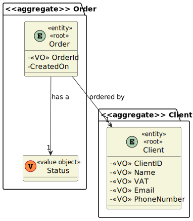
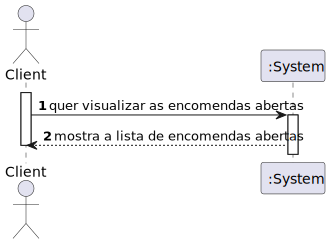
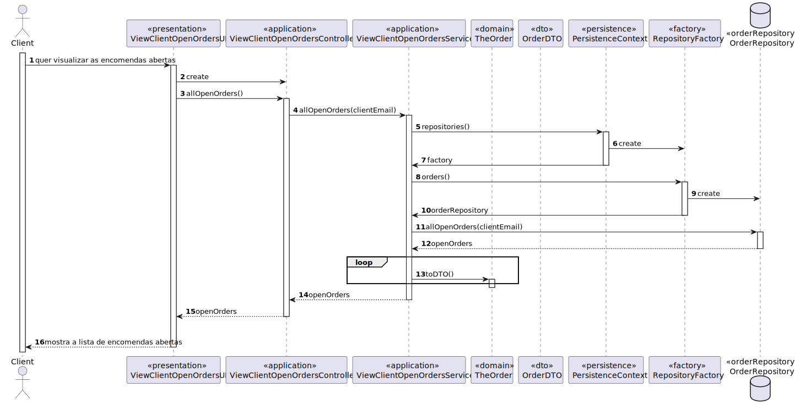
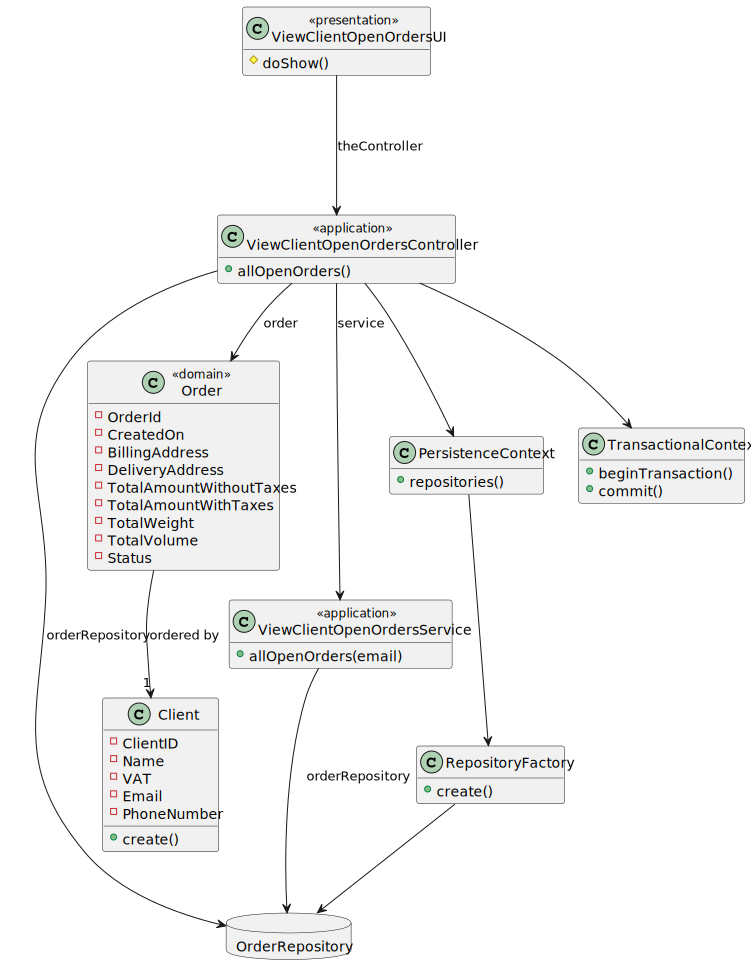

# US1502 - As Customer, I want to view/check the status of my open orders.
=======================================


# 1. Requisitos

US1502 - As Customer, I want to view/check the status of my open orders.

### 1.1 Especificações e esclarecimentos do cliente


# 2. Análise

## 2.1 Excerto do Modelo de Domínio



## 2.2 System Sequence Diagram (SSD)



# 3. Design

## 3.1. Realização da Funcionalidade

## 3.1.1 Sequence Diagram (SD)



## 3.2. Diagrama de Classes



## 3.3. Padrões Aplicados

### Creator

### Repository

### Factory

### Information Expert

## 3.4. Testes 

* There was no need to implement tests as this was a communication between the Client and the Order Server, with OrderServer only getting the orders from the database and return them to the Client.

# 4. Implementação

## Classe ViewClientOpenOrdersController

```
    public Iterable<OrderDTO> allOpenOrders(){
        return service.allOpenOrders(authz.session().get().authenticatedUser().email().toString());
    }
```

## Classe ViewClientOpenOrdersUI

```
    protected boolean doShow() {
        Iterable<OrderDTO> openOrders = controller.allOpenOrders();

        System.out.println("These are your open orders: \n");

        for(OrderDTO openOrder : openOrders){
            System.out.printf("Order: %d \nStatus: %s\n\n", openOrder.orderId(), openOrder.status());
        }

        return false;
    }
```


# 5. Integração/Demonstração

A US foi implementada na sua totalidade, reutilizando métodos da Framework na UI de forma a tornar o código mais compacto, assim como a reutilizar métodos já anteriormente utilizados em US's de Sprints anterios, tal como o findOrdersByStatus(status) de forma a evitar duplicação de código.

# 6. Observações

Fez-se uso de DTO, de forma a que objetos de domínio não contactem diretamente com a UI, respeitando as boas práticas OO.


