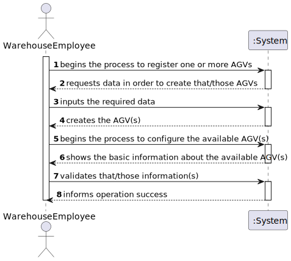
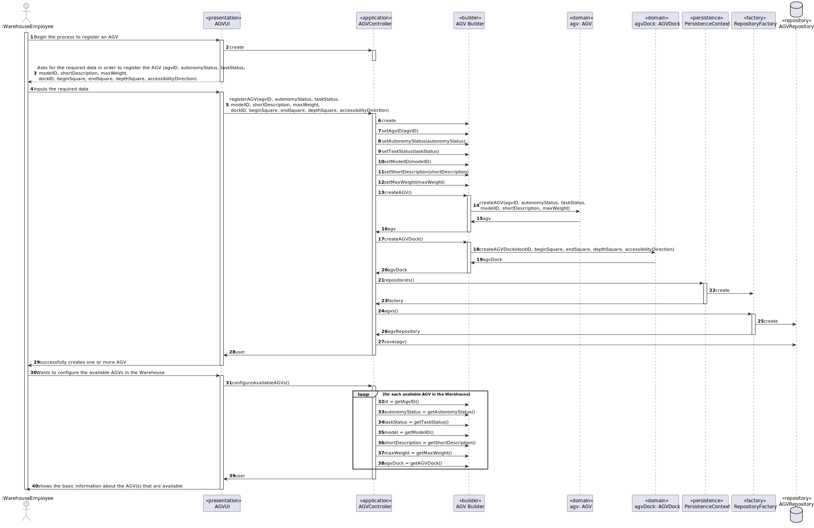
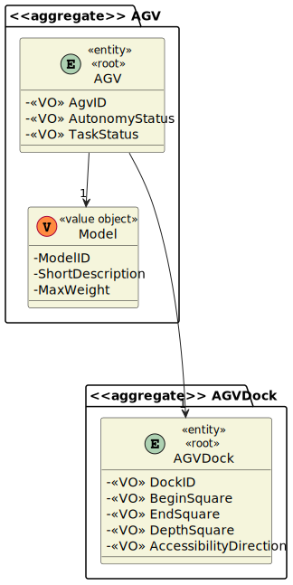
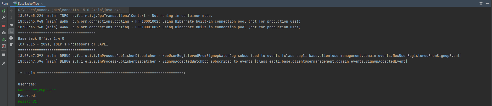
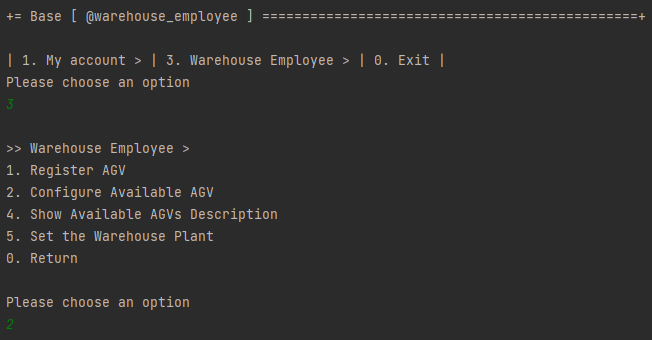
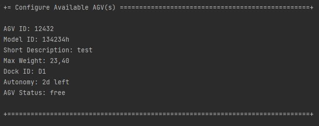

# 2002 - "As Warehouse Employee, I want to configure the AGVs available on the warehouse."

# 1. Requisitos

**UC2002:** Como Warehouse Employee, desejo configurar o(s) AGV(s) disponível/eis na Warehouse.

A interpretação feita deste requisito foi a de mostrar as informações básicas de um ou mais AGVs que estejam disponíveis na Warehouse, em qualquer estado.

# 2. Análise

## 2.1. Respostas do Cliente

>Q1: "What do you understand about configuring the AGV's available on the warehouse. What changes the warehouse employee can do in his specifics and actions/taks?"
>
>A1: "Within this context, "configuring the AGVs available on the warehouse" means that the Warehouse Employee needs to specify which are the AGV operating in the warehouse and, therefore, define some basic information regarding each AGV.
>
> Please, read carefully the specifications' document to find ou which information is need. An highlight is provided below. 
> 
>The AGVs operating on the warehouse, its characteristics (e.g.: identifier, short description, model, and maximum weight it can carry) and its base location (i.e., the AGV dock). In addition, it is necessary to know the AGV status regarding its autonomy (e.g.: 2 hours left) and current task (e.g.: free, charging, occupied serving a given order)." (cf. Specifications' document)"

>Q2: "What should the default autonomy when creating an AGV be?"
>
>A2: "There is no default value. The user must type the AGV autonomy in minutes according to the manufacture specifications."

>Q3: "Should  a list of warehouses be shown for the AGV to be assigned or should the AGV be automatically assigned to the warehouse where the warehouse employee works?"
>
>A3: "As I said before, for now, there is only one warehouse. 
> 
>Do not turn things more complex than they already are."

>Q4: "Could you specify the business rules associated with the identifier, short description, and model of the AGVS."
> 
> A4: "You should apply general validation rules such as:
>
>- identifier: not empty alphanumeric code with at 8 chars maximum;
>
>- short description: not empty having 30 chars maximum;
>
>- model: not empty having 50 chars maximum;
>
>For other necessary attributes, you should follow common-sense."

>Q5: "Are the current tasks provided(free, charging, occupied serving a given order) fixed, or more could be added?" 
>
> A5: I would not called it task but, instead, AGV status.
>
> Besides those statuses I can foresee another status: in maintenance.
>
> If you find out more AGV status useful, you might adopt them and further explain/argue about their pertinence.

## 2.2. Regras de Negócio

* Os IDs dos AGVs, dos AVGDocks e dos Models têm que ser únicos no sistema, com 8 chars no máximo.
* A shortDescription do AGV não pode ser vazia e tem, no máximo, 30 chars.
* O model do AGV não pode ser vazio e tem, no máximo, 50 chars.

# 3. Design

*Nesta secção a equipa deve descrever o design adotado para satisfazer a funcionalidade. Entre outros, a equipa deve apresentar diagrama(s) de realização da funcionalidade, diagrama(s) de classes, identificação de padrões aplicados e quais foram os principais testes especificados para validar a funcionalidade.*

*Para além das secções sugeridas, podem ser incluídas outras.*

## 3.1. Realização da Funcionalidade

### 3.1.1. Classes de Domínio:

* AGV, AVGDock
* Controlador:
    * AGVController
* Repository:
    * AGVRepository

### 3.1.2. Diagrama de Sequência do Sistema:

### 3.1.3. Diagrama de Sequência:

## 3.2. Diagrama de Classes

## 3.3. Padrões Aplicados

*Nesta secção deve apresentar e explicar quais e como foram os padrões de design aplicados e as melhores práticas.*

## 3.4. Testes
*Nesta secção deve sistematizar como os testes foram concebidos para permitir uma correta aferição da satisfação dos requisitos.*

**Test 1:** getter of agvID

    @Test
    public void getAgvID() {
        Assert.assertEquals(Long.valueOf(1234), agv.getAgvID());
    }

**Test 2:** getter of autonomyStatus

    @Test
    public void getAutonomyStatus() {
        Assert.assertEquals(new AutonomyStatus("2h"), agv.getAutonomyStatus());
    }

**Test 3:** getter of taskStatus

    @Test
    public void getTaskStatus() {
        Assert.assertEquals(new TaskStatus("free"), agv.getTaskStatus());
    }

**Test 4:** getter of agvDock

    @Test
    public void getAgvDock() {
        Assert.assertEquals(new AgvDock("165", beginSquare, endSquare, depthSquare, accessibility), agv.getAgvDock());
    }

# 4. Implementação

*Nesta secção a equipa deve providenciar, se necessário, algumas evidências de que a implementação está em conformidade com o design efetuado. Para além disso, deve mencionar/descrever a existência de outros ficheiros (e.g. de configuração) relevantes e destacar commits relevantes;*

    public class ConfigureAvailableAGVController {
      private final AuthorizationService authz = AuthzRegistry.authorizationService();
  
      private final AGVRepository repository = PersistenceContext.repositories().agvs();
  
      public Map<AGV, String> getAvailableAGVInformations(){
          Map<AGV, String> availableAGVsInfo = new HashMap<>();
  
  
          for(AGV agv : repository.findAll()){
              availableAGVsInfo.put(agv, agv.toString()
                      + agv.getModelID().toString()
                      + agv.getAgvDock().toString()
                      + agv.getAutonomyStatus().toString()
                      + agv.getTaskStatus().toString());
          }
  
          return availableAGVsInfo;
      }
    }

# 5. Integração/Demonstração

*Nesta secção a equipa deve descrever os esforços realizados no sentido de integrar a funcionalidade desenvolvida com as restantes funcionalidades do sistema.*

# 6. Observações

*Nesta secção sugere-se que a equipa apresente uma perspetiva critica sobre o trabalho desenvolvido apontando, por exemplo, outras alternativas e ou trabalhos futuros relacionados.*

