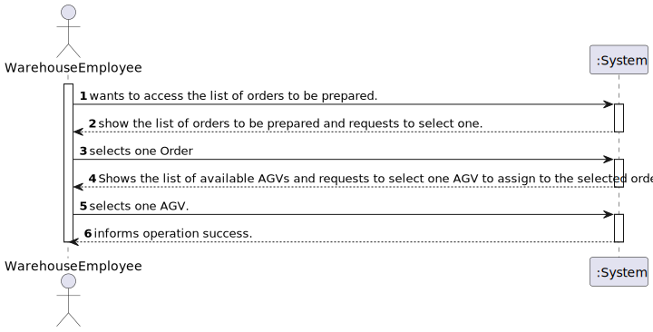
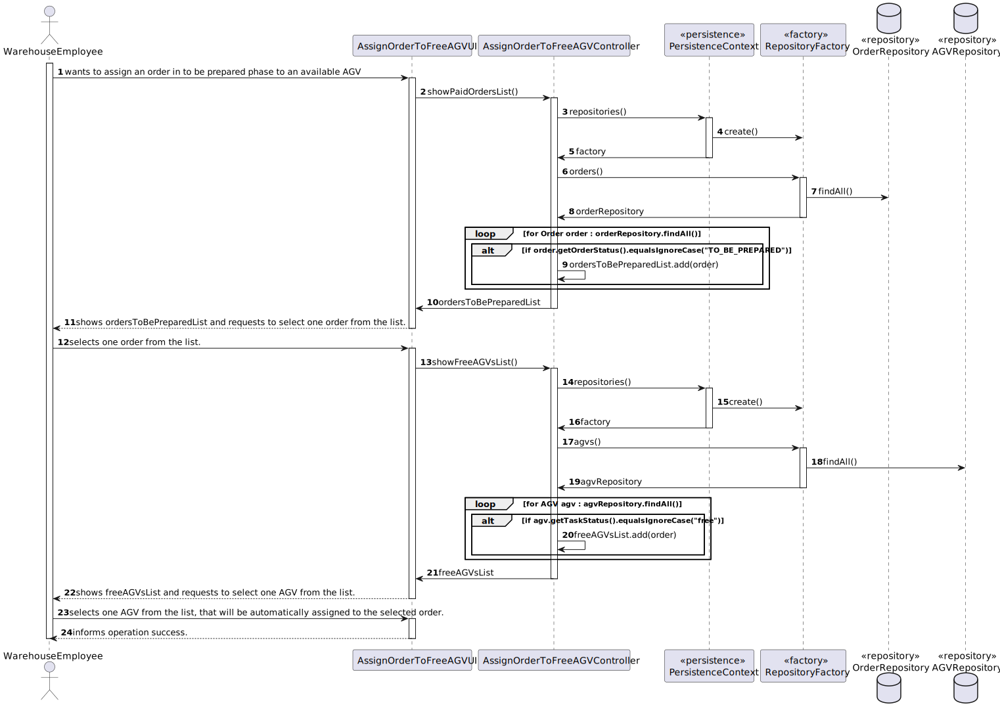
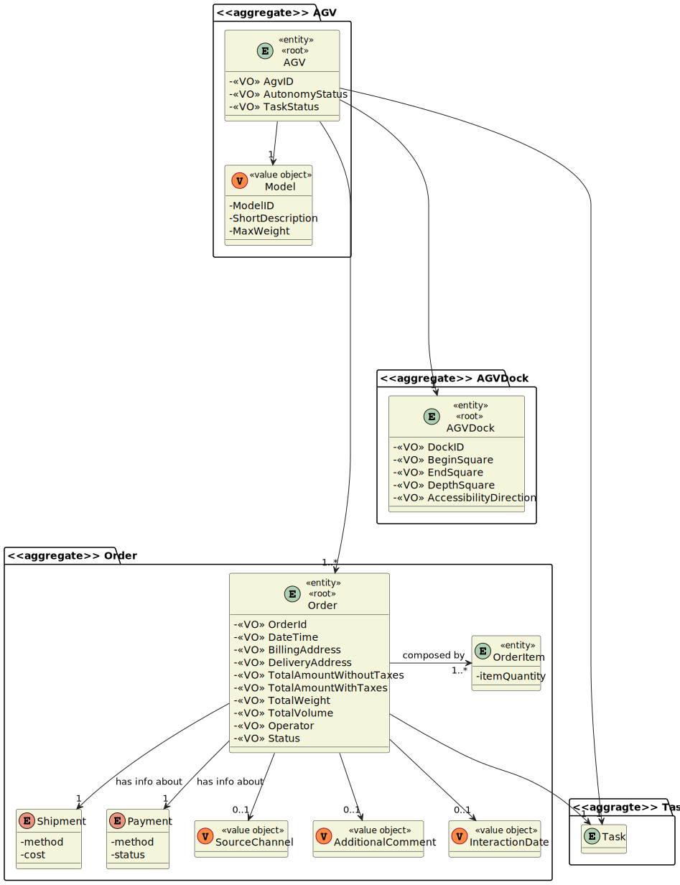
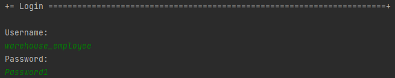
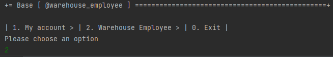
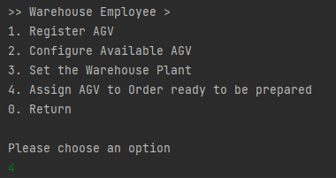
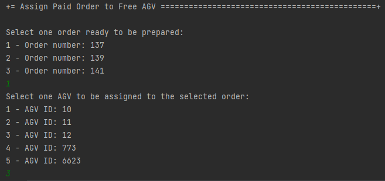

# 2003 - "As Warehouse Employee, I want to access the list of orders that need to be prepared by an AGV and be able to ask/force any of those orders to be immediately prepared by an AGV available. "

# 1. Requisitos

**UC2003:** Como Warehouse Employee, desejo acessar à lista de encomendas que necessitam de ser preparadas por um AGV e conseguir associar, imediatamente, qualquer uma dessas encomendas a um AGV disponível.

A interpretação feita deste requisito foi a de mostrar a lista de encomendas que estão disponíveis para serem preparadas na Warehouse e, a seguir, mostrar a lista de AGVs que estão disponíveis (sem nenhuma tarefa) e associar uma encomenda a um AGV, de maneira que este a prepare.

# 2. Análise

## 2.1. Respostas do Cliente

>Q1: "Regarding US2003, the development team was wondering if the warehouse employee chooses the intended AGV available to prepare the specific order or if it should be assigned to any AGV available without even asking the warehouse employee."
> 
> A1: "In the scope of US 2003, the AGV is selected by the warehouse employee from the ones that are available and are able to perform the task."
 
>Q2: "It is mentioned that the warehouse is able to force a certain task to a certain AGV, but can this only happen when the AGV is free, or can the warehouse employee cancel a task and assign a new one."
> 
> A2: "In the scope of US 2003, the AGV is selected by the warehouse employee from the ones that are available and are able to perform the task. Tasks cannot be manually cancelled."

>Q3: "Regarding this feature, what would you consider to be its complete state, that is, what would be the criterion to define whether or not this feature was functional?"
> 
> A3: "The warehouse employee is able to (i) select an order that needs to be prepared; (ii): select the AGV from the ones that are available and able to perform the task; (iii) the task is sent to the selected AGV and (iv) the order change its status."

>Q4: "Knowing that in US2003 it is only mentioned that the Warehouse Employee will do this action, I would like to know if it is part of the System to allow users with greater skills and responsibilities (Warehouse Managers or Admins) to also perform the same task? If yes, which users?"
> 
> A4: "No! There is not such need."

## 2.2. Regras de Negócio

* Any order that has been paid represents a task that can be assigned
  to an AGV.
* In case an AGV is free, and it has the capacity to carry all the products order (regarding the order total volume and
  weight), such order can be assigned (as a task) to the AGV.
* The assignment of a task to an AGV can be done: Manually by a warehouse employee. In this case, the employee identifies both the
  intended order and the intended AGV.

# 3. Design

*Nesta secção a equipa deve descrever o design adotado para satisfazer a funcionalidade. Entre outros, a equipa deve apresentar diagrama(s) de realização da funcionalidade, diagrama(s) de classes, identificação de padrões aplicados e quais foram os principais testes especificados para validar a funcionalidade.*

*Para além das secções sugeridas, podem ser incluídas outras.*

## 3.1. Realização da Funcionalidade

### 3.1.1. Classes de Domínio:

* AGV, Order
* Controlador:
    * AssignOrderToFreeAGVController
* Repository:
    * AGVRepository
    * OrderRepository

### 3.1.2. Diagrama de Sequência do Sistema:

### 3.1.3. Diagrama de Sequência:

## 3.2. Diagrama de Classes

## 3.3. Padrões Aplicados

*Nesta secção deve apresentar e explicar quais e como foram os padrões de design aplicados e as melhores práticas.*

## 3.4. Testes
*Nesta secção deve sistematizar como os testes foram concebidos para permitir uma correta aferição da satisfação dos requisitos.*

# 4. Implementação

*Nesta secção a equipa deve providenciar, se necessário, algumas evidências de que a implementação está em conformidade com o design efetuado. Para além disso, deve mencionar/descrever a existência de outros ficheiros (e.g. de configuração) relevantes e destacar commits relevantes;*

    public Map<Integer, TheOrder> showPaidOrdersList(){
        authz.ensureAuthenticatedUserHasAnyOf(BaseRoles.POWER_USER, BaseRoles.WAREHOUSE_EMPLOYEE);

        Iterable<TheOrder> ordersAlreadyPaid = new LinkedList<>();
        Map<Integer, TheOrder> paidOrdersList = new HashMap<>();
        OrderStatus orderStatus = OrderStatus.valueOf(OrderStatus.Status.TO_BE_PREPARED);
        int i=1;

        ordersAlreadyPaid = orderRepository.findByOrderStatus(orderStatus);

        for(TheOrder order : ordersAlreadyPaid){
            paidOrdersList.put(i, order);
            i++;
        }

        return paidOrdersList;
    }

    public Map<Integer, AGV> showFreeAGVsList(){
        authz.ensureAuthenticatedUserHasAnyOf(BaseRoles.POWER_USER, BaseRoles.WAREHOUSE_EMPLOYEE);

        Iterable<AGV> agvsAvailable = new LinkedList<>();
        Map<Integer, AGV> freeAGVsList = new HashMap<>();
        int i=1;

        agvsAvailable = agvRepository.findByTaskStatus(TaskStatus.valueOf(TaskStatus.TaskStatusEnum.FREE));

        for(AGV agv : agvsAvailable){
            freeAGVsList.put(i, agv);
            i++;
        }

        return freeAGVsList;
    }

    public TheOrder updateOrder(final TheOrder order){
        orderRepository.remove(order);
        return orderRepository.save(order);
    }

    public AGV updateAGV(final AGV agv){
        agvRepository.remove(agv);
        return agvRepository.save(agv);
    }

# 5. Integração/Demonstração

*Nesta secção a equipa deve descrever os esforços realizados no sentido de integrar a funcionalidade desenvolvida com as restantes funcionalidades do sistema.*

>

>

>

>

# 6. Observações

*Nesta secção sugere-se que a equipa apresente uma perspetiva critica sobre o trabalho desenvolvido apontando, por exemplo, outras alternativas e ou trabalhos futuros relacionados.*

