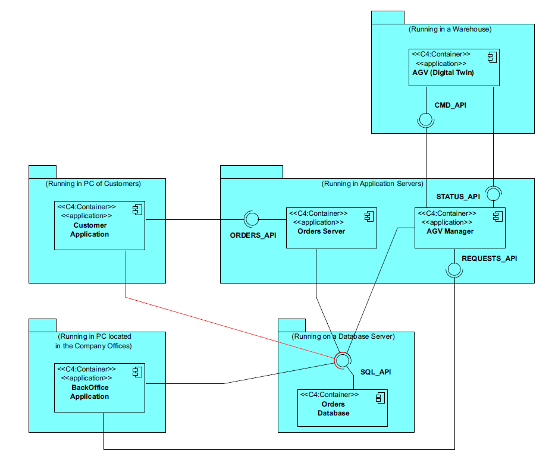
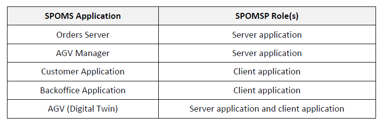

# 4003 - "As Project Manager, I want the communications (of the AGVManager) made through the SPOMS2022 protocol to be secured/protected."

# 1. Requisitos

**UC4003:** Como Project Manager pretendo que o modúlo de comunicação do AGVManager, feito a partir do protocolo SPOMS2022, esteja seguro/protegido.

A interpretação feita deste requisito foi no sentido de deixar seguras as ligações quer do BackOffice, quer do AGVDigitalTwin, ambos clientes do AGVManager.

# 2. Análise

## 2.1. Respostas do Cliente

n/a

## 2.2. Regras de Negócio

* Deve complementar a US4001.
* Deve adotar SSL/TLS com autenticação mútua, baseado em certificados de chave públicos.

# 3. Dados do Servidor AGVManager

| Servidor IP                             | Port | Trusted Store          | Key Store Pass |
|-----------------------------------------|------|------------------------|----------------|
| **Localhost**: 127.0.0.1  | 3700 | serverAgvManager_J.jks | forgotten      |

# 4. Dados dos Clientes do Servidor AGVManager (AGVDigitalTwin & BackOffice)

| Port | Trusted Store          | Key Store Pass |
|------|------------------------|----------------|
| 3700 | clientTwin_J.jks       | forgotten      |
| 3700 | clientBackoffice_J.jks | forgotten      |

# 5. Funcionamento do SSL/TLS com autenticação mútua, baseado em certificados de chave públicos

# 6. Design

## 6.1. Padrões Aplicados

### SPOMS2022

### Threads

### SSL/TLS com autenticação mútua, baseado em certificados de chave públicos

# 6.2. Funcionamento do SSL/TLS com autenticação mútua, baseado em certificados de chave públicos

De um ponto de vista de alto nível, o processo de autenticação e estabelecimento de um canal encriptado, usando autenticação mútua baseada em certificados, envolve as seguintes etapas no TLS:

**1** - Um cliente solicita acesso a um recurso protegido.

**2** - O servidor apresenta o seu certificado ao cliente.

**3** - O cliente verifica o certificado do servidor.

**4** - Se for bem-sucedido, o cliente envia o seu certificado ao servidor.

**5** - O servidor verifica as credenciais do cliente.

**6** - Se for bem-sucedido, o servidor concede acesso ao recurso protegido solicitado pelo cliente.

# 7. Implementação

## 7.1. Classe TcpSrvAgvManager

    [...]
        static final int SERVER_PORT=3700;
        static final String TRUSTED_STORE= System.getProperty("user.dir") + "/certificates/serverAgvManager_J.jks";
        static final String KEYSTORE_PASS="forgotten";
    [...]
        SSLServerSocket sock = null;
        SSLSocket cliSock;
        System.setProperty("javax.net.ssl.trustStore", TRUSTED_STORE);
        System.setProperty("javax.net.ssl.trustStorePassword",KEYSTORE_PASS);
        System.setProperty("javax.net.ssl.keyStore",TRUSTED_STORE);
        System.setProperty("javax.net.ssl.keyStorePassword",KEYSTORE_PASS);
        SSLServerSocketFactory sslF = (SSLServerSocketFactory) SSLServerSocketFactory.getDefault();
        try {
            sock = (SSLServerSocket) sslF.createServerSocket(SERVER_PORT);
            sock.setNeedClientAuth(true);
            System.out.println("Server connection opened!");
        }
        catch(IOException ex) {
            System.out.println("Failed to open server socket");
            System.exit(1);
        }
    [...]

## 7.2. Classe TcpSrvAGVTwin

    [...]
        static final int SERVER_PORT=2400;
        static final String TRUSTED_STORE= System.getProperty("user.dir") + "/certificates/clientTwin_J.jks";
        static final String KEYSTORE_PASS="forgotten";
    [...]
        SSLServerSocket sock = null;
        SSLSocket cliSock;
        System.setProperty("javax.net.ssl.trustStore", TRUSTED_STORE);
        System.setProperty("javax.net.ssl.trustStorePassword",KEYSTORE_PASS);
        System.setProperty("javax.net.ssl.keyStore",TRUSTED_STORE);
        System.setProperty("javax.net.ssl.keyStorePassword",KEYSTORE_PASS);
        SSLServerSocketFactory sslF = (SSLServerSocketFactory) SSLServerSocketFactory.getDefault();
        try {
            sock = (SSLServerSocket) sslF.createServerSocket(SERVER_PORT);
            sock.setNeedClientAuth(true);
            System.out.println("Server connection opened!");
        }
        catch(IOException ex) {
            System.out.println("Failed to open server socket");
            System.exit(1);
        }
    [...]

## 7.3. Classe GetPositions (BackOffice)

    [...]
            SSLSocketFactory sf = (SSLSocketFactory) SSLSocketFactory.getDefault();

            try {
                serverIP = InetAddress.getByName(address);
            } catch (UnknownHostException ex) {
                System.out.println("Invalid server specified: " + serverIP);
                System.exit(1);
            }

            try {
                socket = (SSLSocket) sf.createSocket(serverIP, port);
            }
            catch(IOException ex) {
                System.out.println("Failed to establish TCP connection");
                System.exit(1);
            }

            socket.startHandshake();
    [...]

# 8. Integração/Demonstração

Esta User Story depende da User Story 4001, uma vez que é necessário que a comunicação entre o BackOffice, AGVManager e AGVDigitalTwin exista, para que esta seja protegida.

# 9. Observações

Uma vez que para esta US não é criada qualquer tipo de entidade, não foi criada nenhuma classe de testes.
Também não foram criados diagramas, uma vez que esta US refere-se apenas à interação entre server e client.