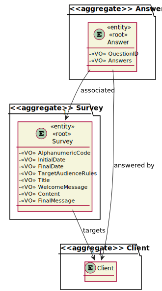
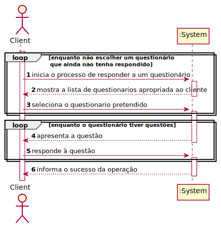
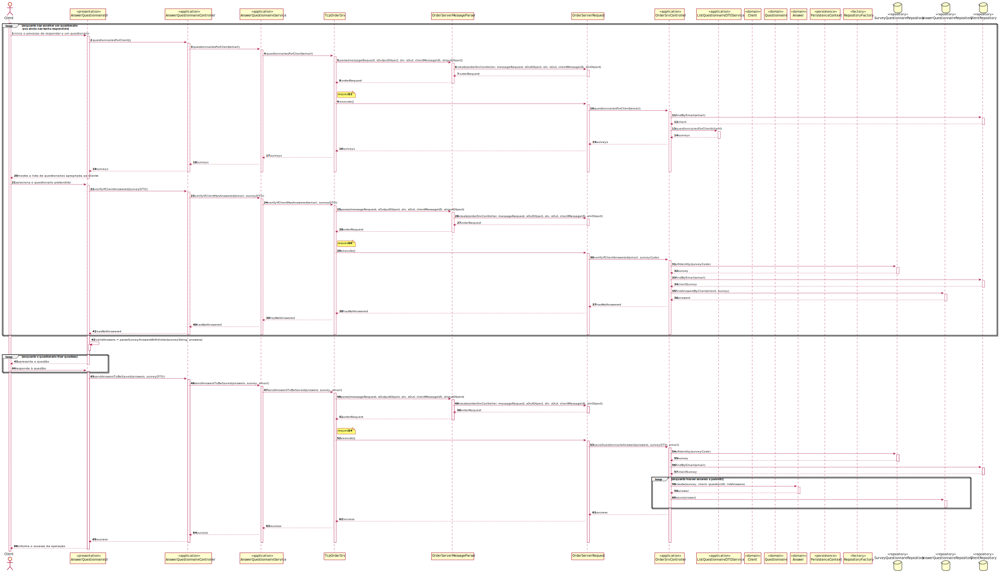
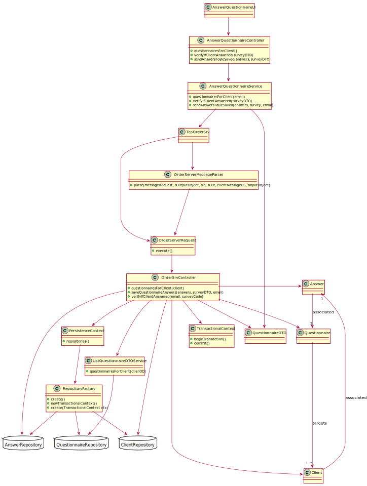

# US3501 - Enquanto cliente, pretendo responder a um questionário
=======================================


# 1. Requisitos

US3501 - Enquanto cliente, pretendo responder a um questionário

### 1.1 Especificações e esclarecimentos do cliente


# 2. Análise

## 2.1 Excerto do Modelo de Domínio



## 2.2 System Sequence Diagram (SSD)



# 3. Design

## 3.1. Realização da Funcionalidade

*Nesta secção deve apresentar e descrever o fluxo/sequência que permite realizar a funcionalidade.*

## 3.1.1 Sequence Diagram (SD)



## 3.2. Diagrama de Classes

*Nesta secção deve apresentar e descrever as principais classes envolvidas na realização da funcionalidade.*



## 3.3. Padrões Aplicados

Foram aplicados os padrões princípios SOLID e GoF

### Creator

### Repository

### Factory

### Information Expert 

*Nesta secção deve apresentar e explicar quais e como foram os padrões de design aplicados e as melhores práticas.*

## 3.4. Testes 
*Nesta secção deve sistematizar como os testes foram concebidos para permitir uma correta aferição da satisfação dos requisitos.*

**Teste 1:** Verificar que não é possível criar uma instância da classe Exemplo com valores nulos.

	@Test(expected = IllegalArgumentException.class)
		public void ensureNullIsNotAllowed() {
		Exemplo instance = new Exemplo(null, null);
	}

# 4. Implementação

### 4.1 Class AnswerQuestionnaireUI

```
QuestionnaireDTO survey = null;

        boolean hasNotAnsweredYet = false;

        while(!hasNotAnsweredYet) {
            Iterable<QuestionnaireDTO> surveys = this.controller.questionnairesForClient();
            final SelectWidget<QuestionnaireDTO> selector = new SelectWidget<>("Questionnaires For Client:", surveys, new QuestionnaireDTOPrinter());
            selector.show();
            survey = selector.selectedElement();
            if(survey == null)
                break;
            hasNotAnsweredYet = controller.verifyIfClientAnswered(survey);
            if(!hasNotAnsweredYet)
                System.out.println("You have already answered that survey! Please, choose another one.");

        }


        if(survey != null) { //the client doesn't want to exit
            String surveyString = extractSurvey(survey);

            Map<String, List<String>> answers = new HashMap<>();

            boolean validAnswers = parseSurveyAnswersWithVisitor(surveyString, answers);

            if(validAnswers) {
                System.out.println("Your answers will be now saved!");
                this.controller.sendAnswersToBeSaved(answers, survey);
                System.out.println("Answers successfuly saved!");
            }
        }


        return false;
    }

    private String extractSurvey(QuestionnaireDTO survey) {
        StringBuilder text = new StringBuilder();
        text.append(survey.code() + " " + survey.title() + "\n");
        if(!survey.welcomeMessage().isEmpty())
            text.append(survey.welcomeMessage() + "\n\n");
        text.append(survey.questionnaireContent() + "\n\n\n\n");
        text.append(survey.finalMessage());
        return text.toString();
    }

    private boolean parseSurveyAnswersWithVisitor(String survey, Map<String, List<String>> answers) {

        try {

            questionnaireLexer lexer = new questionnaireLexer(CharStreams.fromString(survey));
            CommonTokenStream tokens = new CommonTokenStream(lexer);
            questionnaireParser parser = new questionnaireParser(tokens);
            ParseTree tree = parser.survey();
            SurveyVisitorWithAnswer eval = new SurveyVisitorWithAnswer(answers);
            eval.visit(tree);
            return true;
        } catch (Exception e) {
            System.out.println("[ERROR] " + e.getMessage());
            return false;
        }
    }
```

# 5. Integração/Demonstração

Esta US foi implementada na sua totalidade, e responde às necessidades da US3001. De forma a cumprir todos os requisitos para desta US para este sprint, foi necessário adaptar a 3001, de forma a que os questionários tenham um público alvo com regras associadas.

# 6. Observações

O Questionário ficou com uma relação ManyToMany para a sua target audience e, por conseguinte, a query que vai buscar a lista de questionários apropriados ao cliente.


