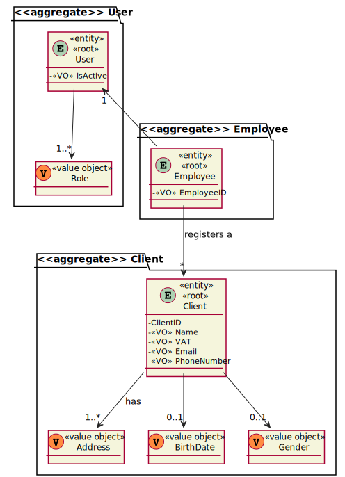
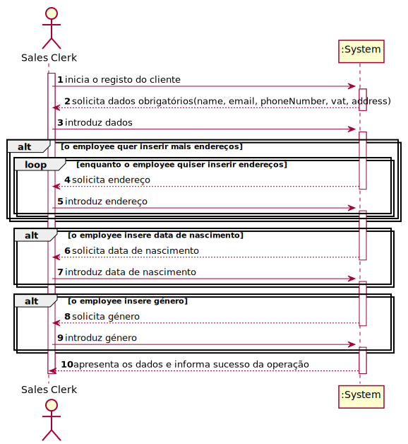
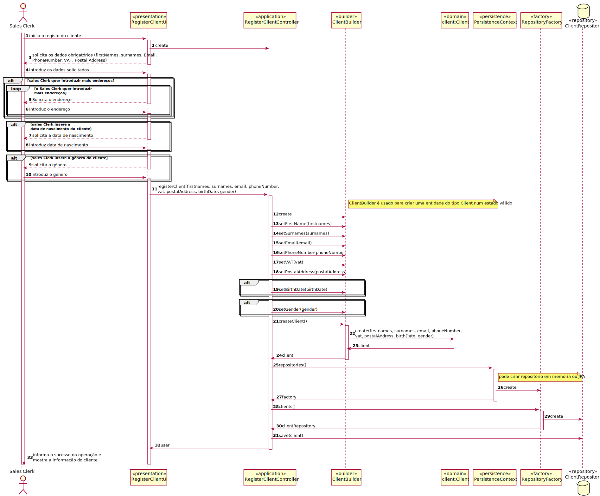
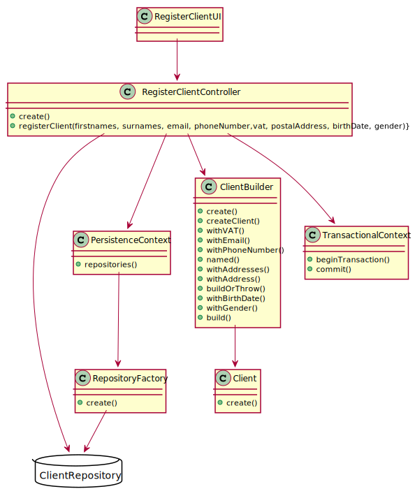

# US1003 - Registar Cliente
=======================================

# 1. Requisitos

US1003 - Como Sales Clerk, pretendo registar um novo cliente.

### 1.1 Especificações e esclarecimentos do cliente

#### Atributos do Cliente

[Question:](https://moodle.isep.ipp.pt/mod/forum/discuss.php?d=15754#p20248)
Name - should we consider first name, last name or is there anything more worth capturing? Are there length restrictions?

[Answer:](https://moodle.isep.ipp.pt/mod/forum/discuss.php?d=15754#p20258)
At least a first and last name is required. Although, desirably the customer should specify his/her full name. Considering this, apply the min/max length you consider as reasonable to meet this requirement.

[Question:](https://moodle.isep.ipp.pt/mod/forum/discuss.php?d=15754#p20248)
VAT ID - which length should it have? Is it only digits or could there be letters?

[Answer:](https://moodle.isep.ipp.pt/mod/forum/discuss.php?d=15754#p20258)
VAT ID varies from one country to another. Usually it has letters and numbers (cf. here). The system must be prepared to support/recognize several VAT Ids.

[Question:](https://moodle.isep.ipp.pt/mod/forum/discuss.php?d=15754#p20248)
Phone number: which lenght/format?

[Answer:](https://moodle.isep.ipp.pt/mod/forum/discuss.php?d=15754#p20258)
Phone number: according to international standards (e.g.: +351 934 563 123).

[Question:](https://moodle.isep.ipp.pt/mod/forum/discuss.php?d=15754#p20248)
Birthday - in which format?

[Answer:](https://moodle.isep.ipp.pt/mod/forum/discuss.php?d=15754#p20258)
Birthday: it is a date... you can adopt year/month/day.

[Question:](https://moodle.isep.ipp.pt/mod/forum/discuss.php?d=15754#p20248)
Address - What kind of format are we expecting for these? Street name, door number, postal code, city, country is a valid format or are we missing anything?

[Answer:](https://moodle.isep.ipp.pt/mod/forum/discuss.php?d=15754#p20258)
Address: I think you said it all.

#### Outros

[Question:](https://moodle.isep.ipp.pt/mod/forum/discuss.php?d=15749) When creating a customer, should it be automatically associated with a login, that is, when entering its data, such as name, and so it is necessary to enter a username and a password?

It says: "The registration is manually performed by a clerk. No account activation is required."

However then it also says this: "Create credential for a customer. At any time, clerks might request the system to generate access credentials to a given customer access the system. The generated credentials are sent by email to the customer and are never shown to the clerk."

Should these features be implemented together?

[Answer:](https://moodle.isep.ipp.pt/mod/forum/discuss.php?d=15749)
There are two distinct scenarios here:

1. The customer is registering him/herself in the system (cf. Use Case 3.1.4a). In this scenario, credentials are generated as soon as the account activation process is successfully completed.

**2. A clerk is registering customers either manually or by importing files (cf. Use Case 3.1.4b and 3.1.4c respectively). In this scenario no account activation process is required and/or performed. Moreover, by default, no customer credentials are to be generated. If such credentials are needed, the clerk undergoes on another use case (cf. Use Case 3.1.5).**

As you already figure it out, it is an excellent idea that at the end of use case 3.1.4b to ask the clerk if (s)he want to perform the use case 3.1.5.

# 2. Análise

## 2.1 Excerto do Modelo de Domínio

## 2.2 System Sequence Diagram (SSD)

# 3. Design

## 3.1. Realização da Funcionalidade

*Nesta secção deve apresentar e descrever o fluxo/sequência que permite realizar a funcionalidade.*

## 3.1.1 Sequence Diagram (SD)

## 3.2. Diagrama de Classes

*Nesta secção deve apresentar e descrever as principais classes envolvidas na realização da funcionalidade.*

## 3.3. Padrões Aplicados

Foram aplicados os padrões princípios SOLID e GoF 

### Builder
- O padrão Builder é usado para encapsular a lógica de construção de um objeto. Foi utilizado devido à criação do Cliente envolver vários atributos opcionais, existindo assim representações múltiplas da classe.

### Creator

### Repository

### Factory

### Information Expert 

*Nesta secção deve apresentar e explicar quais e como foram os padrões de design aplicados e as melhores práticas.*

## 3.4. Testes 
*Nesta secção deve sistematizar como os testes foram concebidos para permitir uma correta aferição da satisfação dos requisitos.*

**Teste 1:** Verificar que não é possível criar uma instância da classe Exemplo com valores nulos.

	@Test(expected = IllegalArgumentException.class)
		public void ensureNullIsNotAllowed() {
		Exemplo instance = new Exemplo(null, null);
	}

# 4. Implementação

## 4.1 Classe ClientBuilder

    public ClientBuilder named(final Name name) {
    this.name = name;
    return this;
    }

    public ClientBuilder withVAT(final VAT vat) {
        this.vat = vat;
        return this;
    }

    public ClientBuilder withEmail(final Email email) {
        this.email = email;
        return this;
    }

    public ClientBuilder withPhoneNumber(final PhoneNumber phoneNumber) {
        this.phoneNumber = phoneNumber;
        return this;
    }

    public ClientBuilder withAddresses(final Set<Address> addresses) {
        if (addresses != null) {
            addresses.forEach(this::withAddress);
        }
        return this;
    }

    public ClientBuilder withAddress(final Address address) {
        this.addresses.add(address);
        return this;
    }

    private Client buildOrThrow() {
        if (theClient != null) {
            return theClient;
        } else if (name != null && vat != null && email != null && phoneNumber != null && !addresses.isEmpty()) {
            theClient = new Client(name, vat, email, phoneNumber, addresses);
            return theClient;
        } else {
            throw new IllegalStateException();
        }
    }

    public ClientBuilder withGender(final Client.Gender gender) {
        if(gender != null) {
            buildOrThrow();
            theClient.addGender(gender);
        }
        return this;
    }

    public ClientBuilder withBirthdate(final Calendar birthdate) {
        if(birthdate != null) {
            buildOrThrow();
            theClient.insertBirthDate(birthdate);
        }
        return this;
    }

    @Override
    public Client build() {
        final Client ret = buildOrThrow();
        theClient = null;
        return ret;
    }

# 5. Integração/Demonstração

Esta User Story foi implementada na totalidade não tendo dependências com outras user stories.

# 6. Observações

Futuramente o sales clerk terá uma opção que será de gerar as credenciais para o cliente tornando-o um utilizador do sistema.

