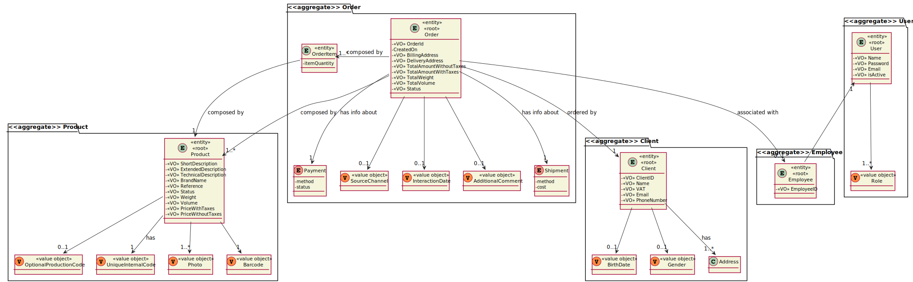
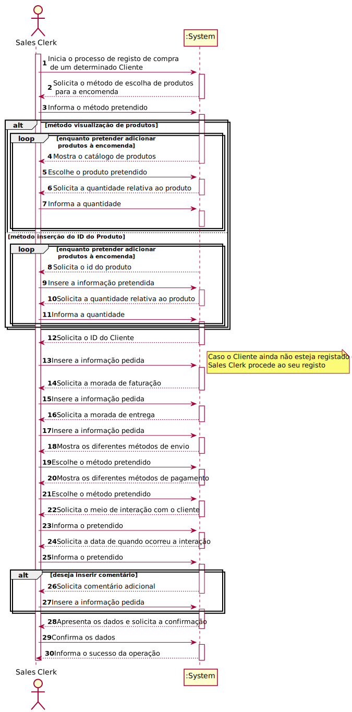
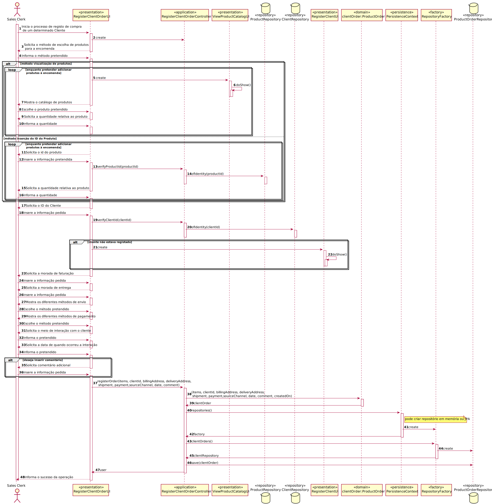
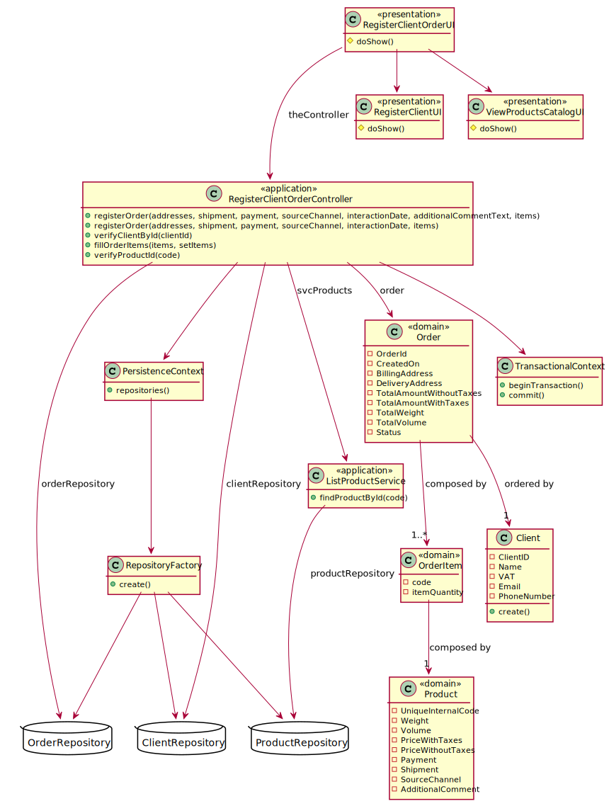

# US1004 - Como Sales Clerk, pretendo criar uma nova encomenda de produtos em nome de um dado cliente.
=======================================

# 1. Requisitos

US1004 - Como Sales Clerk, pretendo criar uma nova encomenda de produtos em nome de um dado cliente.

### 1.1 Especificações e esclarecimentos do cliente

[Question:](https://moodle.isep.ipp.pt/mod/forum/discuss.php?d=15531)
The development team wonders if the order volume and weight should be a calculated based on the products entered in it?  

[Answer:](https://moodle.isep.ipp.pt/mod/forum/discuss.php?d=15531)
Regarding volume, for now, adopt a very basic algorithm to compute the approximate overall volume.  

[Question:](https://moodle.isep.ipp.pt/mod/forum/discuss.php?d=15532)
The development team wonders if shipping methods may change over time? If yes, could this affect past orders?

[Answer:](https://moodle.isep.ipp.pt/mod/forum/discuss.php?d=15532)
As suggested in the specifications' document, during the prototype development, there is no will to devote relevant effort on this matter (cf. page 3).
Information regarding shipping methods might change over time (e.g.: the cost).
No change can affect the information of past orders.  

[Question:](https://moodle.isep.ipp.pt/mod/forum/discuss.php?d=15630)
We have the knowledge that the clerk can create a order on behalf of a given costumer and with that the system might request additional information regarding the source order information, on the project descriptions gives the example of phone number, email and others.
What additional information do you need more?

[Answer:](https://moodle.isep.ipp.pt/mod/forum/discuss.php?d=15630)
Regarding that topic, it is import to recall the following:
"At least for some organizations, it is also important that the system allows sales department clerks to create orders on behalf of a given customer. Thus, the system should collect the required information to distinguish between those orders registered directly by the customer and the ones registered by a clerk. In the latter case, due trackability concerns, the system should be able (at least) to identify the respective clerk."
Despite identifying the clerk registering the order, it is important to register (i) the source channel (e.g.: phone, email, meeting, etc...), (ii) the date/time when such interaction happen and (iii) optionally add some comment.  

[Question:](https://moodle.isep.ipp.pt/mod/forum/discuss.php?d=15646)
Q1: Should the shipment method price be managed later on by the company or it's a constant value that doesn't require future management?
Q2: Should the system be able to add more payment methods later on or are those payments always automatically received and have no verification needed?

[Answer:](https://moodle.isep.ipp.pt/mod/forum/discuss.php?d=15646)
A1: Yes, the shipment price varies from one method to another. Thus, an option to manage such information will be required. But, such development is currently out of scope.
A2: Yes. Multiple  payment methods can be added/supported. Currently, the team just need to be aware that is an extension point and prepare the system for that.

[Question:](https://moodle.isep.ipp.pt/mod/forum/discuss.php?d=15708)
Is it required that the system keep an history of the order state? For example, if an order changes from "payment pending" to "to be prepared", are we required to keep the date of this change for future query?

[Answer:](https://moodle.isep.ipp.pt/mod/forum/discuss.php?d=15708)
Keeping order state history, as suggested, is an interesting feature that will be highly appreciated/valued.

[Question:](https://moodle.isep.ipp.pt/mod/forum/discuss.php?d=15740)
Does the project support more than 1 currency, and if so which currencies should it support?

[Answer:](https://moodle.isep.ipp.pt/mod/forum/discuss.php?d=15740)
Yes! The project must be prepared to easily support several currencies.
The system should work adopting a base currency (e.g.: EUR) and, according to the customer location, be able to present prices on other currencies (e.g. USD) using an external currency converter.
During the prototype development, using a currency converter should not be a major concern.

[Question:](https://moodle.isep.ipp.pt/mod/forum/discuss.php?d=15938)
Question 1: How will the customer pay for the order placed by the clerk. Will receive a notification?
Question 2: After placing the order will the system notify the customer? If so, how?
Question 3: How do you want the clerk to select the products? By putting their id or selecting?

[Answer:](https://moodle.isep.ipp.pt/mod/forum/discuss.php?d=15938)
Question 1: How will the customer pay for the order placed by the clerk. Will receive a notification?
For now, you may assume the clerk selects one of the available payment methods and types the required information.
Yet, I would like to emphasise what is stated in the specifications document:
"While developing the system prototype, these two issues (i.e.: shipment and payment) must be considered. Although, since both are not perceived as representing a risk to the project, the shipment cost computation, and the connections to external systems (e.g.: carriers and payment services) should be mock."

Question 2: After placing the order will the system notify the customer? If so, how?
That is a good idea... the system might send a notification email to the customer.
This functionality will be seen as an asset to distinguish the solutions presented by different development teams.

Question 3: How do you want the clerk to select the products? By putting their id or selecting?

Both: by typing the product id when knowing it or by using searching/browsing the products catalog (US1002).

[Question:](https://moodle.isep.ipp.pt/mod/forum/discuss.php?d=15962)
Regarding US1004 when a sales clerk creates a new order for a given customer, does the customer need to be registered in the system?

[Answer:](https://moodle.isep.ipp.pt/mod/forum/discuss.php?d=15962)
Most of the times, the customer is already registered.
However, it might happen (s)he is not registered. In such case, the customer is registered on that moment using US1003.

# 2. Análise

## 2.1 Excerto do Modelo de Domínio

## 2.2 System Sequence Diagram (SSD)

# 3. Design

## 3.1. Realização da Funcionalidade

## 3.1.1 Sequence Diagram (SD)

## 3.2. Diagrama de Classes

## 3.3. Padrões Aplicados

### Creator

### Repository

### Factory

### Information Expert

## 3.4. Testes 
*Nesta secção deve sistematizar como os testes foram concebidos para permitir uma correta aferição da satisfação dos requisitos.*

**Teste 1:** Verificar que não é possível criar uma instância da classe Client sem os valores obrigatórios.

	@Test(expected = IllegalArgumentException.class)
    public void ensureOrderAddressMustHaveStreeName() {
        new OrderAddress(null, "7", "4520-463", "Rio Meão", "Portugal");
    }

    @Test(expected = IllegalArgumentException.class)
    public void ensureOrderAddressMustHaveDoorNumber() {
        new OrderAddress("Travessa do Outeiro", null, "4520-463", "Rio Meão", "Portugal");
    }

    @Test(expected = IllegalArgumentException.class)
    public void ensureOrderAddressMustHavePostalCode() {
        new OrderAddress("Travessa do Outeiro", "7", null, "Rio Meão", "Portugal");
    }

    @Test(expected = IllegalArgumentException.class)
    public void ensureOrderAddressMustHaveCity() {
        new OrderAddress("Travessa do Outeiro", "7", "4520-463", null, "Portugal");
    }

    @Test(expected = IllegalArgumentException.class)
    public void ensureOrderAddressMustHaveCountry() {
        new OrderAddress("Travessa do Outeiro", "7", "4520-463", "Rio Meão", null);
    }

    @Test(expected = IllegalArgumentException.class)
    public void ensureOrderItemHasCode() {
        new OrderItem(null, 1);
    }

    @Test(expected = IllegalArgumentException.class)
    public void ensureOrderItemHasQuantity() {
        new OrderItem("aaaa.11111", null);
    }

# 4. Implementação

## Classe RegisterClientOrderController

    public TheOrder registerOrder(List<List<String>> addresses, Shipment shipment, Payment payment, TheOrder.SourceChannel sourceChannel, Calendar interactionDate, String additionalCommentText, Map<String, Integer> items) {

        authz.ensureAuthenticatedUserHasAnyOf(BaseRoles.POWER_USER, BaseRoles.SALES_CLERK);

        OrderAddress billingAddress = new OrderAddress(addresses.get(0).get(0), addresses.get(0).get(1),addresses.get(0).get(2),
                addresses.get(0).get(3), addresses.get(0).get(4));

        OrderAddress deliveryAddress = new OrderAddress(addresses.get(1).get(0), addresses.get(1).get(1),addresses.get(1).get(2),
                addresses.get(1).get(3), addresses.get(1).get(4));

        AdditionalComment additionalComment = new AdditionalComment(additionalCommentText);

        Set<OrderItem> orderItems = new HashSet<>();
        fillOrderItems(items, orderItems);

        TheOrder order = new TheOrder(client, billingAddress, deliveryAddress, shipment, payment, sourceChannel, interactionDate, additionalComment, authz.session().get().authenticatedUser(), orderItems);

        return orderRepository.save(order);
    }

    public boolean verifyClientById(Long clientId) {
        Optional<Client> chosenClient = clientRepository.ofIdentity(clientId);
        if(chosenClient.isPresent())
        client = chosenClient.get();
        return client != null;
    }

    public boolean verifyProductById(Code code) {
        Optional<Product> chosenProduct = svcProducts.findProductById(code);
        if(chosenProduct.isPresent())
            product = chosenProduct.get();
        return product != null;
    }

    private void fillOrderItems(Map<String, Integer> items, Set<OrderItem> setItems) {

        for (Map.Entry<String, Integer> entry : items.entrySet()) {
            String code = entry.getKey();
            Integer quantity = entry.getValue();
            OrderItem orderItem = new OrderItem(code,quantity);
            setItems.add(orderItem);
        }
    }

# 5. Integração/Demonstração

Esta User Story foi implementada na sua totalidade, integrando na sua implementação a interação com vários repositórios (ProductRepository, ClientRepository e OrderRepository) e com outras UI's, nomeadamente a RegisterClientUI (para o registo de um cliente) e a ViewProductsCatalogUI (para a visualização dos produtos) de modo a cumprir com os requisitos.

# 6. Observações

A OrderItem será, futuramente, uma Entidade, como representada no Modelo de Domínio.  
Devido a problemas na persistência de dados dessa entidade, enquanto alternativa optou-se por implementar a OrderItem enquanto Value Object.

