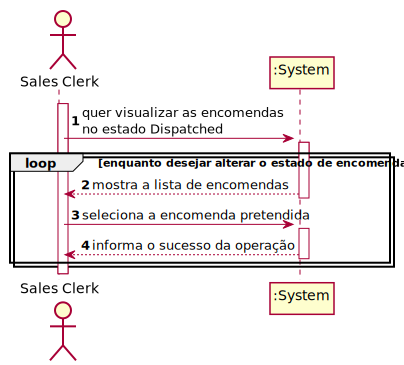

# US1006 - As Sales Clerk, I want to access a list of orders that had been dispatched for costumer delivery and be able to update some of those orders to as being delivered
=======================================


# 1. Requisitos

US1006 - As Sales Clerk, I want to access a list of orders that had been dispatched for costumer delivery and be able to update some of those orders to as being delivered.

### 1.1 Especificações e esclarecimentos do cliente

**FAZER**!!!


# 2. Análise

## 2.1 Excerto do Modelo de Domínio


## 2.2 System Sequence Diagram (SSD)



# 3. Design

## 3.1. Realização da Funcionalidade

## 3.1.1 Sequence Diagram (SD)


## 3.2. Diagrama de Classes


## 3.3. Padrões Aplicados

### Creator

### Repository

### Factory

### Information Expert

## 3.4. Testes 
*Nesta secção deve sistematizar como os testes foram concebidos para permitir uma correta aferição da satisfação dos requisitos.*

**Teste 1:** Verificar que o estado da Order é atualiado para o pretendido.

```
@Test
    public void ensureChangeOrderStatusToExpected() {
        OrderStatus expOrderStatus = OrderStatus.valueOf(OrderStatus.Status.DELIVERED_BY_CARRIER);

        TheOrder order = new TheOrder(client,billingAddress,shippingAdddress,Shipment.BLUE,Payment.APPLE_PAY, TheOrder.SourceChannel.CALL,Calendars.now(),salesClerk,newOrderItems);
        order.changeOrderStatusTo(OrderStatus.Status.DELIVERED_BY_CARRIER);

        OrderStatus orderStatus = order.getOrderStatus();

        assertEquals(expOrderStatus, orderStatus);
    }
```


# 4. Implementação

## Classe ViewOrdersSentToCostumerController

```
public class ViewOrdersSentToCostumerController {
    private final AuthorizationService authz = AuthzRegistry.authorizationService();
    private final ListOrderDTOService service = new ListOrderDTOService();
    private final OrderRepository orderRepository = PersistenceContext.repositories().orders();


    public TheOrder changeStatusToBeingDelievered(Long orderId) {
        authz.ensureAuthenticatedUserHasAnyOf(BaseRoles.POWER_USER, BaseRoles.SALES_CLERK);

        Optional<TheOrder> order = orderRepository.ofIdentity(orderId);
        order.get().changeOrderStatusTo(OrderStatus.Status.DELIVERED_BY_CARRIER);
        return orderRepository.save(order.get());
    }

    public Iterable<OrderDTO> getOrdersDispatchedForCustomerDelivery() {
        return service.findOrdersWithStatus(OrderStatus.valueOf(OrderStatus.Status.DISPATCHED));
    }
```

## Classe ViewOrdersSentToCostumerUI

```
@Override
    protected boolean doShow() {
        String answer = "yes";
        while(answer.equalsIgnoreCase("yes")) {
            final Iterable<OrderDTO> ordersDispatchedForClient = this.theController.getOrdersDispatchedForCustomerDelivery();

            final SelectWidget<OrderDTO> selector = new SelectWidget<>("Orders Dispatched For Client:", ordersDispatchedForClient,
                    new OrderDTOPrinter());
            selector.show();
            final OrderDTO orderDTO = selector.selectedElement();
            if(orderDTO != null) {
                this.theController.changeStatusToBeingDelievered(orderDTO.orderId());
                System.out.println(">> Status successfully changed!");
                answer = Console.readLine("Do you wish to change the Status of any more Orders?  (yes/no)");
            } else {
                answer = "no";
            }
        }
        return false;
    }
```


# 5. Integração/Demonstração

A US foi implementada na sua totalidade, reutilizando métodos da Framework na UI de forma a tornar o código mais compacto, assim como a reutilizar métodos já anteriormente utilizados em US's de Sprints anterios, tal como o findOrdersByStatus(status) de forma a evitar duplicação de código.

# 6. Observações

Fez-se uso de DTO, de forma a que objetos de domínio não contactem diretamente com a UI, respeitando as boas práticas OO.


