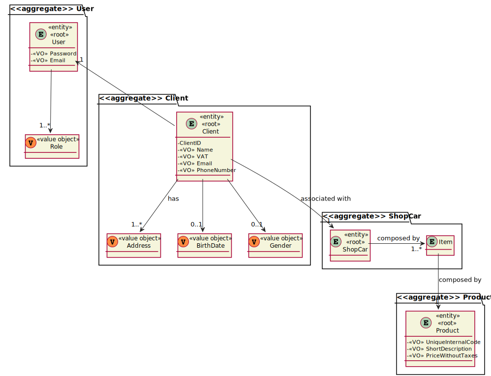
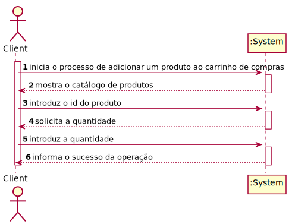
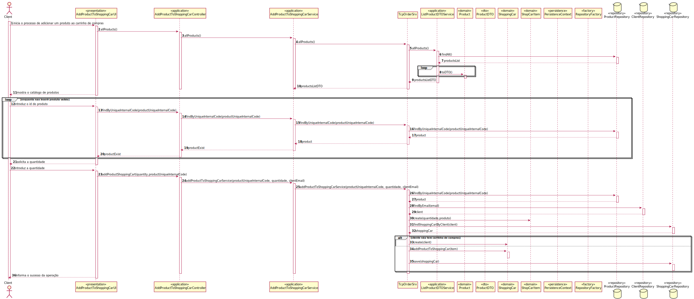
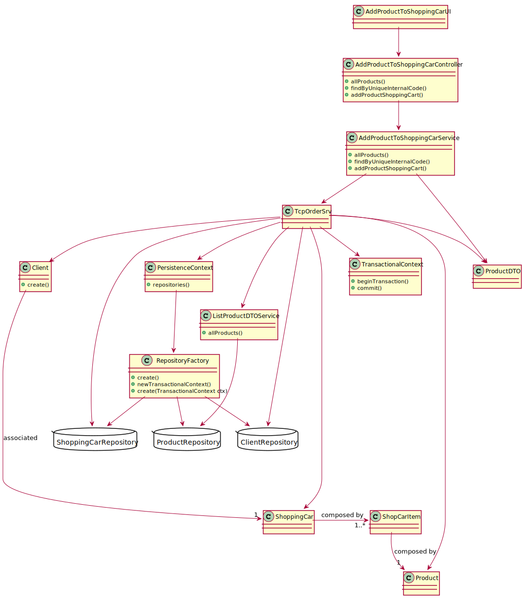

# US1501 - Add a Product to the Shopping Cart
=======================================


# 1. Requisitos

US1501 - As Customer, I want to view/search the product catalog and be able to add a product to the shopping cart.

# 2. Análise

## 2.1 Excerto do Modelo de Domínio



## 2.2 System Sequence Diagram (SSD)



# 3. Design

## 3.1. Realização da Funcionalidade

## 3.1.1 Sequence Diagram (SD)



## 3.2. Diagrama de Classes




## 3.3. Padrões Aplicados

### Creator

### Repository

### Factory

### Information Expert

## 3.4. Testes 

### Class ShoppingCart

**Teste 1:** Verificar que não é possível criar uma instância da classe ShoppingCart com cliente nulo.

	@org.junit.Test(expected = IllegalArgumentException.class)
    void ensureShoppingCartHasClient() {
        new ShoppingCart(null);
    }

**Teste 2:** Verificar que o método addProductToShoppingCar() guarda corretamente a quantidade e o produto.
```        
        @Test
        void addProductToShoppingCar() {
        ShoppingCart shoppingCart = new ShoppingCart(buildClient());

        int expQuantity = 3;
        int expSize = 1;
        ShopCarItem item = new ShopCarItem(3,new Product(Code.valueOf("aaaa.12345"),Barcode.valueOf("123456789012"),ShortDescription.valueOf("this is a short description"),ExtendedDescription.valueOf("this is a very very very very very extended description"), Money.euros(2.0), Product.Status.AVAILABLE,Weight.valueOf(2.0),Volume.valueOf(3.0),Money.euros(3.0),new ProductCategory(AlphaNumericCode.valueOf("22abc"),CategoryDescription.valueOf("this is a catory description"))));

        shoppingCart.addProductToShoppingCar(item);
        assertEquals(expSize, shoppingCart.items().size());
        assertEquals(expQuantity, shoppingCart.items().get(0).quantity());
        }
```

### Class ShopCarItem

**Teste 1:** Verificar que não é possível criar uma instância da classe ShopCarItem com produto nulo.
```
    @Test(expected = IllegalArgumentException.class)
    public void ensureShopCartItemHasProduct() {
    new ShopCarItem(3, null);
    }
```

**Teste 2:** Verificar que não é possível criar uma instância da classe ShopCarItem com quantidade inferior a 0.
```
    @Test(expected = IllegalArgumentException.class)
    public void ensureShopCartItemHasQuantityGreater0() {
        new ShopCarItem(-1, new Product(Code.valueOf("aaaa.12345"), Barcode.valueOf("123456789012"), ShortDescription.valueOf("this is a short description"), ExtendedDescription.valueOf("this is a very very very very very extended description"), Money.euros(2.0), Product.Status.AVAILABLE,Weight.valueOf(2.0),Volume.valueOf(3.0),Money.euros(3.0),new ProductCategory(AlphaNumericCode.valueOf("22abc"),CategoryDescription.valueOf("this is a catory description"))));
    }
```

# 4. Implementação

### Class AddProductToShoppingCarService
```
public class AddProductToShoppingCarService {

    private static class ClientSocket {
        private Socket sock;
        private InetAddress serverIP;
        private DataOutputStream sOutData;
        private DataInputStream sInData;

        public void connect(final String address, final int port) throws IOException {

            try {
                serverIP = InetAddress.getByName(address);
            } catch (UnknownHostException ex) {
                System.out.println("Invalid server specified: " + serverIP);
                System.exit(1);
            }

            try {
                sock = new Socket(serverIP, port); }
            catch(IOException ex) {
                System.out.println("Failed to establish TCP connection");
                System.exit(1);
            }

            System.out.println("Connected to: " + serverIP + ":" + port);

            sOutData = new DataOutputStream(sock.getOutputStream());
            sInData = new DataInputStream(sock.getInputStream());
        }

        public void stop() throws IOException {
            sock.close();
        }

    }
    
    public boolean allProducts(){
        //Omitted...
    }
    
    public boolean findByUniqueInternalCode(String productUniqueInternalCode) {
        //Omitted...
    }
    
    public boolean addProductToShoppingCarService( String uniqueInternalCode, int quantidade, String clientEmail) {
        //Omitted...
    }
```


# 5. Integração/Demonstração

Esta User Story foi implementada na sua totalidade, integrando na sua implementação a interação com vários repositórios (ProductRepository, ClientRepository e ShoppingCartRepository) e recorreu ao uso de um serviço denomiado AddProductToShoppingCarService de forma a cumprir com os requisitos e boas práticas.

# 6. Observações

N/A


