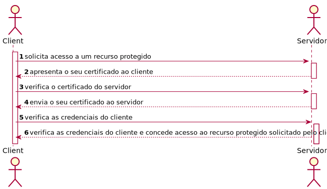

# US1902 - As Project Manager, I want the communications made through the SPOMS2022 protocol to be secured/protected.
=======================================

# 1. Requisitos

US1902 - As Project Manager, I want the communications made through the SPOMS2022 protocol to be secured/protected.

# 2. Dados do Servidor da Order

| Servidor IP                             | Port  | Trusted Store     | Key Store Pass |
|-----------------------------------------|-------|-------------------|----------------|
| **Localhost**: 127.0.0.1  | 10000 | serverOrder_J.jks | forgotten      |

# 3. Dados do Cliente do Servidor Order

| Port  | Trusted Store     | Key Store Pass |
|-------|-------------------|----------------|
| 10000 | clientOrder_J.jks | forgotten      |

* Todos os clientes registados no sistema usam o mesmo certificado.

#4. Funcionamento do SSL/TLS com autenticação mútua, baseado em certificados de chave públicos

# 5. Certificados  

Todos os certificados, tanto do servidor como do cliente, de forma a estabelecer uma conexão TCP de forma segura de acordo com o protocolo SSL/TLS,  são gerados a partir do script do ficheiro make_certs.sh (certificates/make_certs.sh).

#6. Implementação

## 4.1. Classe TcpOrderSrv

    [...]
        static final int SERVER_PORT=10000;
        static final String TRUSTED_STORE= System.getProperty("user.dir") + "/certificates/serverOrder_J.jks";
        static final String KEYSTORE_PASS="forgotten";
    [...]
        SSLServerSocket sock = null;
        SSLSocket cliSock;

        System.setProperty("javax.net.ssl.trustStore", TRUSTED_STORE);
        System.setProperty("javax.net.ssl.trustStorePassword",KEYSTORE_PASS);
        
        System.setProperty("javax.net.ssl.keyStore",TRUSTED_STORE);
        System.setProperty("javax.net.ssl.keyStorePassword",KEYSTORE_PASS);
        
        SSLServerSocketFactory sslF = (SSLServerSocketFactory) SSLServerSocketFactory.getDefault();
        try {
            sock = (SSLServerSocket) sslF.createServerSocket(SERVER_PORT);
            sock.setNeedClientAuth(true);

        }
        catch(IOException ex) {
            System.out.println("Failed to open server socket");
            System.exit(1);
        }

        while(true) {
        cliSock=sock.accept();
        new Thread(new TcpSrvOrderThread(cliSock)).start();
        }
    [...]

## 4.2. Cliente

    public void connect(final String address, final int port) throws IOException {

            // Trust these certificates provided by servers
            System.setProperty("javax.net.ssl.trustStore", TRUSTED_STORE);
            System.setProperty("javax.net.ssl.trustStorePassword",KEYSTORE_PASS);

            // Use this certificate and private key for client certificate when requested by the server
            System.setProperty("javax.net.ssl.keyStore",TRUSTED_STORE);
            System.setProperty("javax.net.ssl.keyStorePassword",KEYSTORE_PASS);

            SSLSocketFactory sf = (SSLSocketFactory) SSLSocketFactory.getDefault();

            try {
                serverIP = InetAddress.getByName(address);
            } catch (UnknownHostException ex) {
                System.out.println("Invalid server specified: " + serverIP);
                System.exit(1);
            }

            try {
                sock = (SSLSocket) sf.createSocket(serverIP,SERVER_PORT); }
            catch(IOException ex) {
                System.out.println("Failed to establish TCP connection");
                System.exit(1);
            }

            System.out.println("Connected to: " + serverIP + ":" + port);

            sock.startHandshake();

            sOutData = new DataOutputStream(sock.getOutputStream());
            sInData = new DataInputStream(sock.getInputStream());
        }

        public void stop() throws IOException {
            sock.close();
        }

    }
    [...]

# 5. Integração/Demonstração

Esta User Story não tem dependências com outras US's.

# 6. Observações

Existe um ambiente virtual destinado à Order Server.  
Apesar de o jar correr de forma bem sucedida nos servidores do isep, ao chamar os repositórios das bases de dados necessários à execução desta US, dá erro.  
