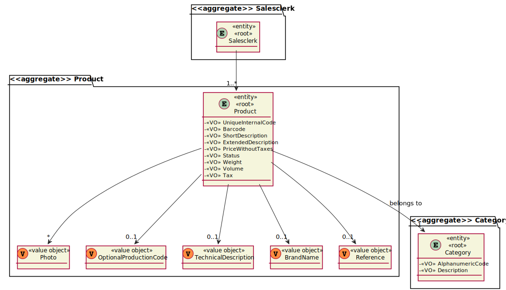
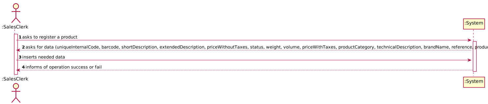
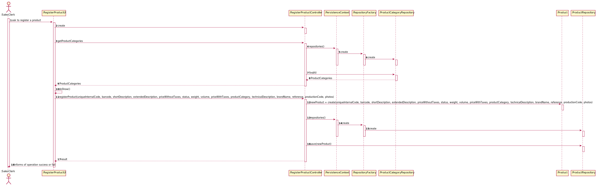
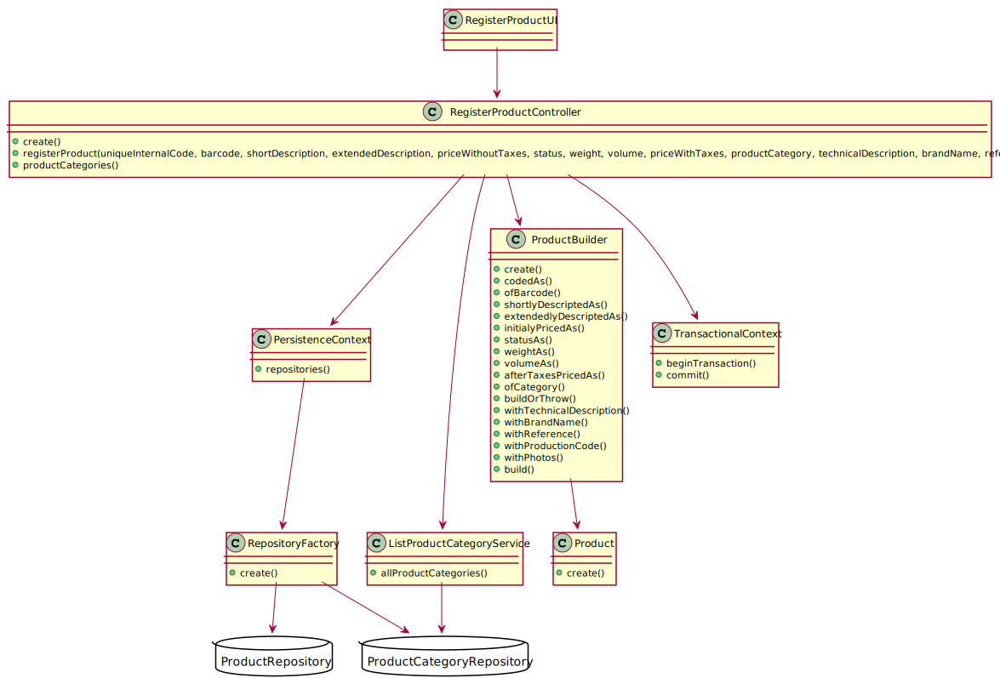

# 1001 - "As Sales Clerk, I want to specify a new product for sale."

# 1. Requisitos

**UC1001:** Como Sales Clerk pretendo criar um novo produto para venda.

A interpretação feita deste requisito foi no sentido de criar um novo produto e colocá-lo disponível para compra.

# 2. Análise

## 2.1. Respostas do Cliente

>Q1: "Can the Product be a part of a Super Category and a Category or will the Product be a part of a Category and that Category is a part of the Super Category?"
>
>A1: "...Contrary to what is suggested in your question, there is no hierarchy between categories."

>Q2: "Regarding the barcode of a given product what should the coding standard be?"
>
>A2: "Any of the supported standards. It might be set by configuration at system implantation time."

>Q3: "Still regarding the barcode should the identifier be sequential, if not what method should we use to generate the identifier?"
>
>A3: "Barcodes are manually introduced by users since each product barcode is provided by the product manufacture."

>Q4: "It was mentioned in a previous question that both the production code and the internal code have a set regular expression, could an example of said regular expressions be given?"
>
>A4: "For example, 4 letters followed by a dot (".") and ending with 5 digits."

>Q5: "Can the regular expression be changed by an employee, if so which one?"
>
>A5: "No! Such regular expressions are set by configuration at system implantation time."

>Q6: "Regarding the barcode of the product should an image be generated or only the code be saved?"
>
>A6: "No image is required to be generated."

>Q7: Regarding the measures of the product(width/length/height and weight) what are the units of measurement that should be supported?
>
>A7: "...the width, length and height of a product is specified in millimeters..." "...the weight of the product is specified in grams."

>Q8: "Reference refers to the brand reference or product reference?"
> 
>A8: "The intent was to express that a product has a brand name (e.g.: "Samsung", "Nokia", "Bic") and the product reference set by the brand, which is an alphanumeric code (max. 23 chars)."

>Q9: "The development team wonders whether in a product registration the attributes "photo", "internal code", "short description", "extended description", "technical description", "brand", "reference", "production code" are mandatory and how big they are?"
>
>A9: "Some information regarding each of those attributes:
>
> photo: it might be of any common format (e.g. png, jpeg, svg); 
> 
> short description: not empty having 30 chars maximum; 
> 
> extended description: not empty with a minimum of 20 chars and 100 chars maximum; 
> 
> technical description: multiple lines of text, preferably with no limit or the biggest possible. 
> 
> brand: not empty having 50 chars maximum; 
> 
> reference: not empty alphanumeric code with at 23 chars maximum; 
> 
> production code: not empty alphanumeric code with at 23 chars maximum however it might meet a given regular expression defined/configured at deployment time. 
> 
> internal code: not empty alphanumeric code with at 23 chars maximum however it might meet a given regular expression defined/configured at deployment time. 
> 
> Mandatory attributes: internal code, short and extended description. 
> 
> In accordance with the specification document, other atributes might also be mandatory."

>Q10: "Are the internal code, production code and reference generated or entered?"
>
>A10: "That information is all entered/typed by the user."

>Q11: "About the photo in the product, we would like to know how it is associated to the product. Should we write the path to it, or should a window open to import the photo into the program?"
>
>A11: "From a usability perspective, it would be better having a window (or any other way) to select the photo file to be uploaded. However, if by some reason that option is not viable by now the user can write the path but the system must validate it."

>Q12: "Given that all the units of a product are located in a single warehouse, should in the moment of creation of the product the sales clerk chose one of the available? If so should it indicate the aisle, row and shelf, where the products are located?"
>
>A12: "Yes, the product location might be specified during US 1001. In this context, it is worth recalling the following:
> 
>"The products’ location in the warehouse, which corresponds to a storage area i.e., the aisle identifier, the row identifier, and the shelf identifier. All these identifiers are numeric. Products with an unknown location cannot the ordered." (cf. specifications document)."

>Q13: "Does the project support more than 1 currency, and if so which currencies should it support?"
> 
>A13: "Yes! The project must be prepared to easily support several currencies. The system should work adopting a base currency (e.g.: EUR) and, according to the customer location, be able to present prices on other currencies (e.g. USD) using an external currency converter. During the prototype development, using a currency converter should not be a major concern."

>Q14: "When creating a new Product, what Currency should we use?"
>
>A14: "It should be used the system base currency, which must be defined at system deployment time."

## 2.2. Regras de Negócio

* A referência de um produto tem que ser única no sistema;
* O preço sem taxas é sempre superior a zero Euros;
* A taxa de um produto é sempre superior ou igual a zero Euros;
* O peso de um produto é sempre superior a zero;
* O volume de um produto é sempre superior a zero;
* O status de um produto pode apenas ser Available, Temporarily Unavailable ou Unavailable.

# 3. Design

## 3.1. Realização da Funcionalidade

### 3.1.1. Modelo de Domínio:

### 3.1.2. Classes de Domínio:

* Product, ProductCategory
* Product um agregado independente de ProductCategory:
  * relação unidirecional many-to-one
* Barcode
* Code
* Photos
* Weight
* Volume
* BrandName
* Reference
* ShortDescription
* ExtendedDescription
* TechnicalDescription
* Controlador:
  * RegisterProdutController
* Repository:
  * ProductRepository
  * ProductCategoryRepository
* ListProductCategoryRepository

### 3.1.3. Diagrama de Sequência do Sistema:

### 3.1.4. Diagrama de Sequência:

## 3.2. Diagrama de Classes

## 3.3. Padrões Aplicados

Foram aplicados os padrões princípios SOLID e GoF

### Builder

### Creator

### Repository

### Factory

### Information Expert

## 3.4. Testes

**Teste 1:** Verificar que é possível criar uma instância da classe Product apenas com os parâmetros obrigatórios.

	@Test
    public void ensureProductWithObrigatoryParameters(){
        new Product(Code.valueOf("abcd.12345"),Barcode.valueOf("123456789012"),ShortDescription.valueOf("Short description."), ExtendedDescription.valueOf("Very very very very very very very extended description."),
                Money.euros(1.5), Product.Status.AVAILABLE,Weight.valueOf(10),Volume.valueOf(5.3),Money.euros(3),new ProductCategory(AlphaNumericCode.valueOf("code"),CategoryDescription.valueOf("this is the description of a category")));
        assertTrue(true);
    }

**Teste 2:** Verificar que é possível fazer build de uma instância da classe Product apenas com os parâmetros obrigatórios.

	@Test
    public void ensureCanBuildProductWithObrigatoryParameters(){
        final Product product = new ProductBuilder()
                .codedAs(Code.valueOf("abcd.12345"))
                .ofBarcode(Barcode.valueOf("123456789012"))
                .shortlyDescriptedAs(ShortDescription.valueOf("short description"))
                .extendedlyDescriptedAs(ExtendedDescription.valueOf("exteeeeeeeeeeeeendeeeeed descriptioooon"))
                .initialyPricedAs(Money.euros(1))
                .statusAs("AVAILABLE")
                .weightAs(Weight.valueOf(1))
                .volumeAs(Volume.valueOf(0.05))
                .afterTaxesPricedAs(Money.euros(2.3))
                .ofCategory(new ProductCategory(AlphaNumericCode.valueOf("code"),CategoryDescription.valueOf("this is the description of a category")))
                .build();
        assertNotNull(product);
    }

**Teste 3:** Verificar que é possível fazer build de uma instância da classe Product com todos os parâmetros.

	@Test
    public void ensureCanBuildProductWithAllParameters(){
        Set<Photo> photos = new HashSet<>();
        photos.add(new Photo("docs/photos/shampoo.png"));
        photos.add(new Photo("docs/photos/shampoo_on_use.jpg"));
        final Product product = new ProductBuilder()
                .codedAs(Code.valueOf("abcd.12345"))
                .ofBarcode(Barcode.valueOf("123456789012"))
                .shortlyDescriptedAs(ShortDescription.valueOf("short description"))
                .extendedlyDescriptedAs(ExtendedDescription.valueOf("exteeeeeeeeeeeeendeeeeed descriptioooon"))
                .initialyPricedAs(Money.euros(1))
                .statusAs("AVAILABLE")
                .weightAs(Weight.valueOf(1))
                .volumeAs(Volume.valueOf(0.05))
                .afterTaxesPricedAs(Money.euros(2.3))
                .ofCategory(new ProductCategory(AlphaNumericCode.valueOf("code"),CategoryDescription.valueOf("this is the description of a category")))
                .withTechnicalDescription(TechnicalDescription.valueOf("this is a very technical description"))
                .withBrandName(BrandName.valueOf("the brand"))
                .withReference(Reference.valueOf("12345brand"))
                .withProductionCode(Code.valueOf("dggd.34656"))
                .withPhotos(photos)
                .build();
        assertNotNull(product);
    }

**Teste 4:** Verificar que não é possível criar uma instância da classe Product com UniqueInternalCode nulo.

	@Test(expected = IllegalArgumentException.class)
    public void ensureCannotBuildProductWithNullUniqueInternalCode(){
        final Product product = new ProductBuilder()
                .codedAs((String) null)
                .ofBarcode(Barcode.valueOf("123456789012"))
                .shortlyDescriptedAs(ShortDescription.valueOf("short description"))
                .extendedlyDescriptedAs(ExtendedDescription.valueOf("exteeeeeeeeeeeeendeeeeed descriptioooon"))
                .initialyPricedAs(Money.euros(1))
                .statusAs("AVAILABLE")
                .weightAs(Weight.valueOf(1))
                .volumeAs(Volume.valueOf(0.05))
                .afterTaxesPricedAs(Money.euros(2.3))
                .ofCategory(new ProductCategory(AlphaNumericCode.valueOf("code"),CategoryDescription.valueOf("this is the description of a category")))
                .build();
    }

**Os testes do 5 ao 13 são feitos usando a mesma lógica do teste 4:**

**Teste 5:** Verificar que não é possível criar uma instância da classe Product com Barcode nulo.

**Teste 6:** Verificar que não é possível criar uma instância da classe Product com ShortDescription nula.

	
**Teste 7:** Verificar que não é possível criar uma instância da classe Product com ExtendedDescription nula.

	
**Teste 8:** Verificar que não é possível criar uma instância da classe Product com PriceWithoutTaxes nulo.

	
**Teste 9:** Verificar que não é possível criar uma instância da classe Product com Status nulo.

	
**Teste 10:** Verificar que não é possível criar uma instância da classe Product com Weight nula.

	
**Teste 11:** Verificar que não é possível criar uma instância da classe Product com Volume nulo.

	
**Teste 12:** Verificar que não é possível criar uma instância da classe Product com PriceWithTaxes nulo.

	
**Teste 13:** Verificar que não é possível criar uma instância da classe Product com ProductCategory nula.

	
**Teste 14:** Verificar que não é possível criar uma instância da classe Product sem UniqueInternalCode.

	@Test(expected = IllegalArgumentException.class)
    public void ensureCannotBuildProductWithNullUniqueInternalCode2(){
        final Product product = new ProductBuilder()
                .ofBarcode(Barcode.valueOf("123456789012"))
                .shortlyDescriptedAs(ShortDescription.valueOf("short description"))
                .extendedlyDescriptedAs(ExtendedDescription.valueOf("exteeeeeeeeeeeeendeeeeed descriptioooon"))
                .initialyPricedAs(Money.euros(1))
                .statusAs("AVAILABLE")
                .weightAs(Weight.valueOf(1))
                .volumeAs(Volume.valueOf(0.05))
                .afterTaxesPricedAs(Money.euros(2.3))
                .ofCategory(new ProductCategory(AlphaNumericCode.valueOf("code"),CategoryDescription.valueOf("this is the description of a category")))
                .build();
    }

**Os testes do 15 ao 23 são feitos usando a mesma lógica do teste 4:**

**Teste 15:** Verificar que não é possível criar uma instância da classe Product sem Barcode.

	
**Teste 16:** Verificar que não é possível criar uma instância da classe Product sem ShortDescription.

	
**Teste 17:** Verificar que não é possível criar uma instância da classe Product sem ExtendedDescription.

**Teste 18:** Verificar que não é possível criar uma instância da classe Product sem PriceWithoutTaxes.

**Teste 19:** Verificar que não é possível criar uma instância da classe Product sem Status.

**Teste 20:** Verificar que não é possível criar uma instância da classe Product sem Weight.

**Teste 21:** Verificar que não é possível criar uma instância da classe Product sem Volume.

**Teste 22:** Verificar que não é possível criar uma instância da classe Product sem PriceWithTaxes.

**Teste 23:** Verificar que não é possível criar uma instância da classe Product sem ProductCategory.

# 4. Implementação

## 4.1. Classe ProductBuilder

    [...]

    public ProductBuilder ofCategory(final ProductCategory productCategory){
        category=productCategory;
        return this;
    }

    public ProductBuilder shortlyDescriptedAs(final String shortDescription){
        return shortlyDescriptedAs(ShortDescription.valueOf(shortDescription));
    }

    public ProductBuilder shortlyDescriptedAs(final ShortDescription shortDescription){
        this.shortDescription=shortDescription;
        return this;
    }

    public ProductBuilder extendedlyDescriptedAs(final String extendedDescription){
        return shortlyDescriptedAs(ShortDescription.valueOf(extendedDescription));
    }

    public ProductBuilder extendedlyDescriptedAs(final ExtendedDescription extendedDescription){
        this.extendedDescription=extendedDescription;
        return this;
    }

    public ProductBuilder codedAs(final String uniqueInternalCode){
        return codedAs(Code.valueOf(uniqueInternalCode));
    }

    public ProductBuilder codedAs(final Code uniqueInternalCode){
        this.uniqueInternalCode=uniqueInternalCode;
        return this;
    }

    public ProductBuilder ofBarcode(final String barcode){
        return ofBarcode(Barcode.valueOf(barcode));
    }

    public ProductBuilder ofBarcode(final Barcode barcode){
        this.barcode=barcode;
        return this;
    }

    public ProductBuilder initialyPricedAs(final Money priceWithoutTaxes){
        this.priceWithoutTaxes=priceWithoutTaxes;
        return this;
    }

    public ProductBuilder statusAs(final String status){
        return statusAs(Product.Status.valueOf(status));
    }

    public ProductBuilder statusAs(final Product.Status status){
        this.status=status;
        return this;
    }

    public ProductBuilder weightAs(final Weight weight){
        this.weight=weight;
        return this;
    }

    public ProductBuilder volumeAs(final Volume volume){
        this.volume=volume;
        return this;
    }

    public ProductBuilder afterTaxesPricedAs(final Money priceWithTaxes){
        this.priceWithTaxes=priceWithTaxes;
        return this;
    }

    private Product buildOrThrow(){
        if (theProduct!=null){
            return theProduct;
        } else if (category!=null && barcode!=null && shortDescription!=null && extendedDescription!=null &&
        priceWithoutTaxes!=null && status!=null && weight!=null && volume!=null && priceWithTaxes!=null){
            theProduct = new Product(uniqueInternalCode, barcode, shortDescription, extendedDescription,
                    priceWithoutTaxes, status, weight, volume, priceWithTaxes, category);
            return theProduct;
        } else {
            throw new IllegalStateException();
        }
    }

    public ProductBuilder withTechnicalDescription(final TechnicalDescription technicalDescription){
        if (technicalDescription!=null) {
            buildOrThrow();
            theProduct.changeTechnicalDescription(technicalDescription);
        }
        return this;
    }

    public ProductBuilder withBrandName(final BrandName brandName){
        if (brandName!=null){
            buildOrThrow();
            theProduct.changeBrandName(brandName);
        }
        return this;
    }

    public ProductBuilder withReference(final Reference reference){
        if (reference!=null) {
            buildOrThrow();
            theProduct.changeReference(reference);
        }
        return this;
    }

    public ProductBuilder withProductionCode(final Code productionCode){
        if (productionCode!=null) {
            buildOrThrow();
            theProduct.changeProductionCode(productionCode);
        }
        return this;
    }

    public ProductBuilder withPhotos(final Set<Photo> photos){
        if (photos != null) {
            for (Photo photo : photos) {
                withPhoto(photo);
            }
        }
        return this;
    }

    public ProductBuilder withPhoto(final Photo photo){
        buildOrThrow();
        theProduct.addPhoto(photo);
        return this;
    }

    @Override
    public Product build() {
        final Product ret = buildOrThrow();
        theProduct = null;
        return ret;
    }

# 5. Integração/Demonstração

Esta User Story foi implementada na totalidade, sendo dependente da US1005, uma vez que os Products estão associados a Product Categories.

# 6. Observações

Perante a resposta do cliente à pergunta 9, presente na secção 2.1 deste 
documento, a frase "technical description: multiple lines of text, preferably 
with no limit or the biggest possible." não foi interpretada como um pedido para
que a technical description seja representada por um array de Strings, mas sim como
um pedido para que esta não tenha limite de tamanho e, como consequência, possa ser 
longa ao ponto de ocupar várias linhas.