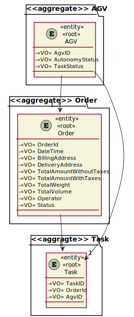
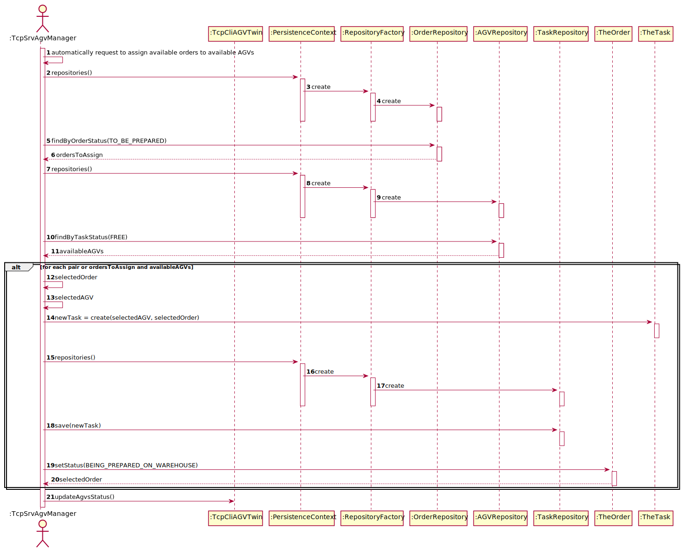
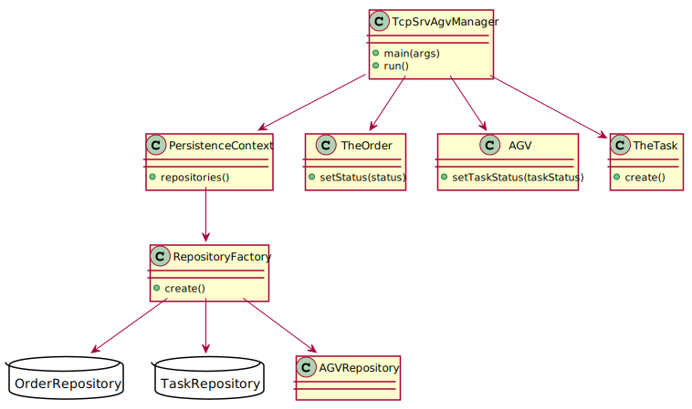
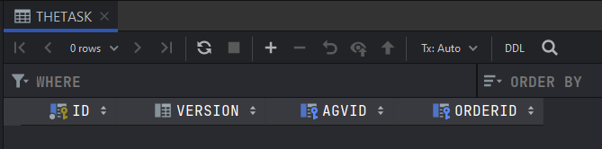
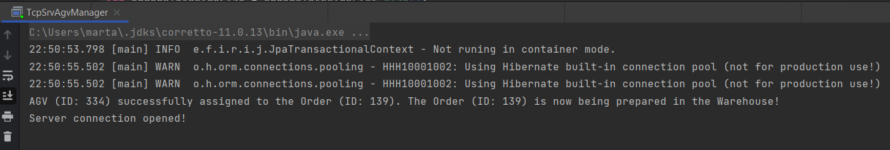
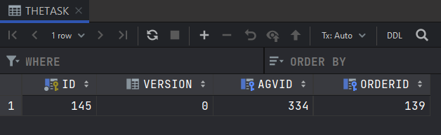

# 4002 - "As Project Manager, I want that the "AGVManager" component is enhanced with a basic FIFO algorithm to automatically assign tasks to AGVs."

# 1. Requisitos

**UC4002:** Como Project Manager pretendo que a componente "AGVManager" seja aprimorada com um algoritmo FIFO (first in first out) básico, para atribuir automáticamente tarefas aos AGVs.

A interpretação feita deste requisito foi no sentido de, através do AGVManager, atribuir, automáticamente, orders aos AGVs.

# 2. Análise

## 2.1. Respostas do Cliente

>Q1: "Will the FIFO algorithm be used to control the tasks/orders that are waiting for an available AGV? If I am interpreting something wrong please clarify for me."
>
>A1: "The general idea is that product orders reaching a certain state whose meaning is of "need to be prepared by an AGV" are added to a queue. Then, following the FIFO algorithm orders are removed from the queue and assigned to available AGVs capable of performing the task that such order implies."

>Q2: "Talking about being automatic, the System executes this functionally after some other functionality, or executes it periodically? If it is periodically, how often?"
>
>A2: "Teams are free to propose a solution for that problem/issue. Notice that all team decisions must be well supported in light of business need and technical constraints."

>Q3: "In US4002 it is required that the AGV Manager should support automatic assignment of orders to AGVs. In US2003 the Warehouse Employee will be able to assign any order to an AGV available. If the orders are being automatically assigned to an AGV (US4002) how can the Warehouse Employee assign a specific order to an AGV?"
> 
>A3: "Usually, and by default, one intends that system automatically assigns orders to AGVs (US 4002). However, if such option is not available (e.g.: turned off) or by some reason an order needs to be prepared faster than it would normally be, the warehouse employee has the ability to assign tasks manually (US 2003). Notice that, orders that can be prepared by AGVs are being added to a queue following a FIFO algorithm (part of the US 4002). In the scope of US 2003 the FIFO algorithm does not apply... the employee might choose the order (s)he wants."

## 2.2. Regras de Negócio

* O algoritmo desenvolvido deve ser do tipo FIFO (first in first out)

# 3. Design

## 3.1. Realização da Funcionalidade

### 3.1.1. Modelo de Domínio:

### 3.1.2. Classes de Domínio:

* TheOrder, AGV
* OrderStatus
* TaskStatus
* Controlador:
  * AutomaticallyAssignOrdersToFreeAGVController
* Repository:
  * OrderRepository
  * AGVRepository

### 3.1.3. Diagrama de Sequência do Sistema:

### 3.1.4. Diagrama de Sequência:

## 3.2. Diagrama de Classes

## 3.3. Padrões Aplicados

Foram aplicados os padrões princípios SOLID e GoF

### Creator

### Repository

### Factory

# 4. Implementação

## 4.1. Classe TcpSrv

    [...]

    TheOrder selectedOrder;
    AGV selectedAGV;
    List<TheOrder> ordersToAssign = ordersToAGVController.getOrdersToAssign();
    List<AGV> agvsAvailable = ordersToAGVController.getAGVsAvailable();
    if (ordersToAssign.isEmpty()){
        System.out.println("There are no orders waiting to be assigned.");
    } else if (agvsAvailable.isEmpty()){
        System.out.println("There are no available AGVs.");
    } else {
        int number = 0;
        int ordersToAssignSize = ordersToAssign.size();
        int agvsAvailableSize = agvsAvailable.size();
        do {
            selectedOrder = ordersToAssign.get(number);
            selectedAGV = agvsAvailable.get(number);
            ordersToAGVController.registerTask(selectedAGV,selectedOrder);
            selectedOrder.setStatus(OrderStatus.valueOf(OrderStatus.Status.BEING_PREPARED_ON_WAREHOUSE));
            ordersToAGVController.updateOrder(selectedOrder);
            selectedAGV.setTaskStatus(TaskStatus.valueOf(TaskStatus.TaskStatusEnum.OCCUPIED));
            ordersToAGVController.updateAGV(selectedAGV);
            System.out.printf("AGV (ID: %d) successfully assigned to the Order (ID: %d). The Order (ID: %d) is now being prepared in the Warehouse!\n", selectedAGV.getAgvID(), selectedOrder.getOrderId(), selectedOrder.getOrderId());
            number++;
        } while (number + 1 <= ordersToAssignSize && number + 1 <= agvsAvailableSize);

    [...]

    

# 5. Integração/Demonstração

Esta User Story depende da User Story 4001, uma vez que é necessária a existência do AGVManager para que esta US funcione do modo pretendido.

TheTask table before US:

US execution:

TheTask table after US:

# 6. Observações

Uma vez que para esta US é apenas criada uma UI e um Controller, não sendo criado qualquer tipo de entidade, não foi criada nenhuma classe de testes.