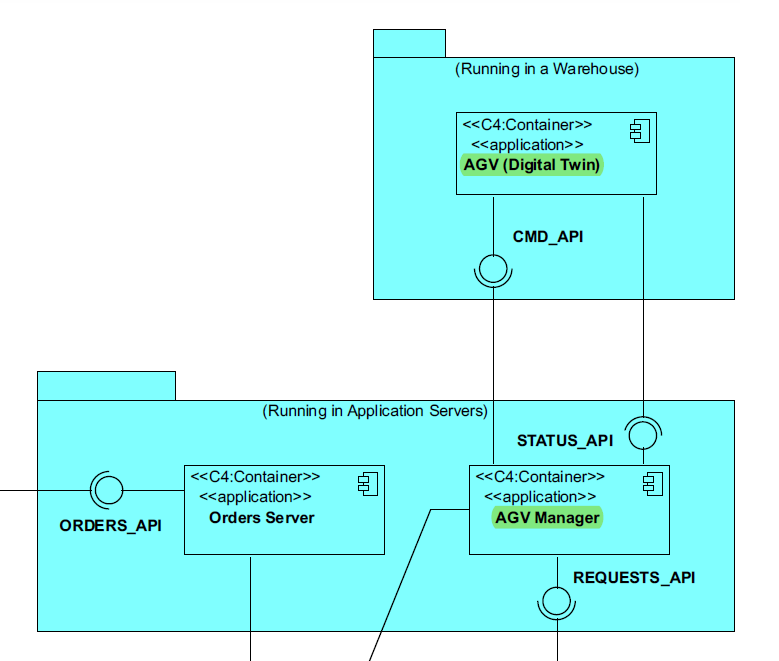
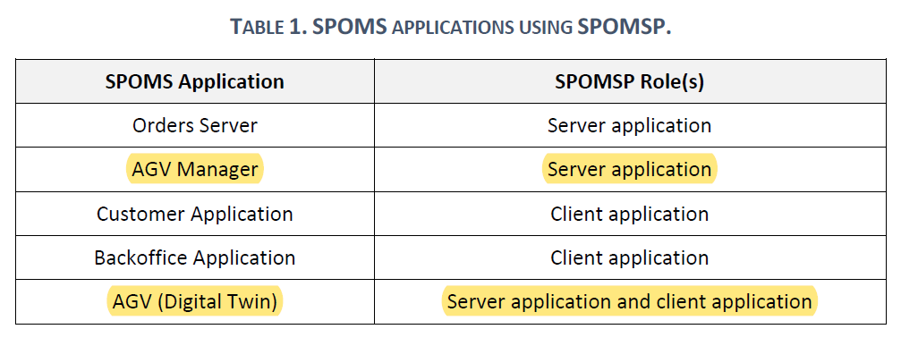

# 5002 - "As Project Manager,  I want that the team start developing the output communication module of the AGV digital twin to update its status on the "AGVManager"."

# 1. Requisitos

**UC5002:** Como Project Manager pretendo que a equipa comece a desenvolver o modúlo de comunicação por output do AGV digital twin, para atualizar o seu status no "AGVManager".

A interpretação feita deste requisito foi no sentido de desenvolver o AGV digital twin, permitindo-lhe pedir ao AGV Manager para atualizar os status dos AGVs e, depois, enviar os AGVs com os status atualizados ao AGV Manager, para que este os atualize.

# 2. Análise

## 2.1. Respostas do Cliente

>Q1: Regarding the USs 1901,4001, 5001, and 5002, what would you consider its complete state, that is, what would be the criterion to define whether or not this US is functional?
>
>A1: For all of those US, the communication between the two involved components must be implemented in accordance with the SPOMS2022. The requests processing can be somehow mocked. For instance, if processing a request implies saving some data to the database, the component can instead write such data to a log (mocking). Latter, on next sprint, the teams implement the interaction to the database. However, it is not advisable mocking everything, namely the components (internal) state. Notice that by mocking you are letting extra effort to the next sprint. Finally, all US must be demonstrable.

>Q2: What type of communication do you want, i.e., what are the communications that you want to have between these two. Like AGV Manager says "Take a product" and AGV Digital Twin says "Taken"? Is it something like that? Or am i confused?
> 
>A2: The communication must follow the SPOMS2022 protocol. It is up to you and your team to devise a set of messages fulfilling the business requirements properly.

## 2.2. Regras de Negócio

* Deve ser utilizado o protocolo de aplicação fornecido (SPOMS2022).
* Sugere-se a adoção de mecanismos concorrentes (por exemplo, threads) e compartilhamento de estados entre esses mecanismos.
* Neste sprint, para fins de demonstração, é aceitável simular o processamento de algumas das solicitações recebidas para promover alguma comunicação de saída.

# 3. Design

## 3.1. Padrões Aplicados

### SPOMS2022

### Threads

# 3.2 Fluxo de Troca de Mensagens entre o Servidor e o Cliente

* Sempre que o cliente solicita um request, através de uma conexão TCP, segue-se o seguinte fluxo de comunicação:

**1.** Espera pela mensagem do Cliente com o Código de Teste (0).  
**2.** Manda ao Cliente o Código de Entendido (2).
**3.** Cliente solicita o request desejado através do seu código associado  
**4.** Socket aguarda mensagem do client e verifica qual o request a executar através do código

<-----------------------Execução do Request----------------------->

* Para terminar o request, o servidor:

**5.** Espera pela mensagem do Cliente com o Código de Fim (1).  
**6.** Manda ao Cliente o Código de Entendido (2).  
**7.** Fecha o Socket.

# 4. Implementação

## 4.1. Classe TcpCliAGVTwin

    [...]
        sOutObject.writeObject(agvsToUpdate);
        sOutObject.flush();
    [...]
    

## 4.2. Classe TcpSrvAgvManager

    
    [...]
        ObjectInputStream getAGVsChangedList = new ObjectInputStream(s.getInputStream());
        List<AGV> agvsToChange = new LinkedList<>();
        for (AGV agv : taskRepository.findAllAGV()) {
            if (Objects.equals(agv.getTaskStatus(), TaskStatus.valueOf(TaskStatus.TaskStatusEnum.FREE))){
                agvsToChange.add(agv);
            }
        }
    [...]

# 5. Integração/Demonstração

No âmbito desta US, são efetuados os seguintes requests:

| Código | Request                     |
|--------|-----------------------------|
| 7      | Atualizar os status dos AGV |

Esta User Story depende da User Story 4001, uma vez que é necessária a existência do AGVManager para que esta US funcione do modo pretendido.

# 6. Observações

Uma vez que para esta US não é criada qualquer tipo de entidade, não foi criada nenhuma classe de testes.
Também não foram criados diagramas, uma vez que esta US refere-se apenas à interação entre server e client.
Para este Sprint, foi criado um ambiente virtual destinado ao AGV Digital Twin Client e Server.  
Apesar de o jar correr de forma bem sucedida nos servidores do isep, ao chamar os repositórios das bases de dados necessários à execução desta US, dá erro.  
Será algo a resolver no próximo Sprint.