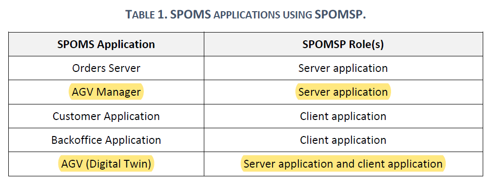

# 5004 - "As Project Manager, I want the output communications (of the AGV Digital Twin) made through the SPOMS2022 protocol to be secured/protected."

# 1. Requisitos

**UC5004:** Como Project Manager pretendo que o modúlo de comunicação por output do AGV digital twin, feito a partir do protocolo SPOMS2022, esteja seguro/protegido.

A interpretação feita deste requisito foi no sentido de deixar seguras as ligações de output para o AGV digital twin.

# 2. Análise

## 2.1. Respostas do Cliente

n/a

## 2.2. Regras de Negócio

* Deve complementar a US5002.
* Deve adotar SSL/TLS com autenticação mútua, baseado em certificados de chave públicos.

# 3. Design

## 3.1. Padrões Aplicados

### SPOMS2022

### Threads

### SSL/TLS com autenticação mútua, baseado em certificados de chave públicos

# 3.2 Funcionamento do SSL/TLS com autenticação mútua, baseado em certificados de chave públicos

De um ponto de vista de alto nível, o processo de autenticação e estabelecimento de um canal encriptado, usando autenticação mútua baseada em certificados, envolve as seguintes etapas no TLS:

**1** - Um cliente solicita acesso a um recurso protegido.

**2** - O servidor apresenta o seu certificado ao cliente.

**3** - O cliente verifica o certificado do servidor.

**4** - Se for bem-sucedido, o cliente envia o seu certificado ao servidor.

**5** - O servidor verifica as credenciais do cliente.

**6** - Se for bem-sucedido, o servidor concede acesso ao recurso protegido solicitado pelo cliente.

# 4. Implementação

## 4.1. Classe TcpSrvAgvManager

    [...]
        static final int SERVER_PORT=3700;
        static final String TRUSTED_STORE= System.getProperty("user.dir") + "/certificates/serverAgvManager_J.jks";
        static final String KEYSTORE_PASS="forgotten";
    [...]
        SSLServerSocket sock = null;
        SSLSocket cliSock;
        System.setProperty("javax.net.ssl.trustStore", TRUSTED_STORE);
        System.setProperty("javax.net.ssl.trustStorePassword",KEYSTORE_PASS);
        System.setProperty("javax.net.ssl.keyStore",TRUSTED_STORE);
        System.setProperty("javax.net.ssl.keyStorePassword",KEYSTORE_PASS);
        SSLServerSocketFactory sslF = (SSLServerSocketFactory) SSLServerSocketFactory.getDefault();
        try {
            sock = (SSLServerSocket) sslF.createServerSocket(SERVER_PORT);
            sock.setNeedClientAuth(true);
            System.out.println("Server connection opened!");
        }
        catch(IOException ex) {
            System.out.println("Failed to open server socket");
            System.exit(1);
        }
    [...]

## 4.2. Classe TcpSrvAGVTwin

    [...]
        
    [...]

# 5. Integração/Demonstração

Esta User Story depende da User Story 5002, uma vez que é necessário que a comunicação entre o AGV Manager e o AGV Digital Twin exista, para que esta seja protegida.

# 6. Observações

Uma vez que para esta US não é criada qualquer tipo de entidade, não foi criada nenhuma classe de testes.
Também não foram criados diagramas, uma vez que esta US refere-se apenas à interação entre server e client.